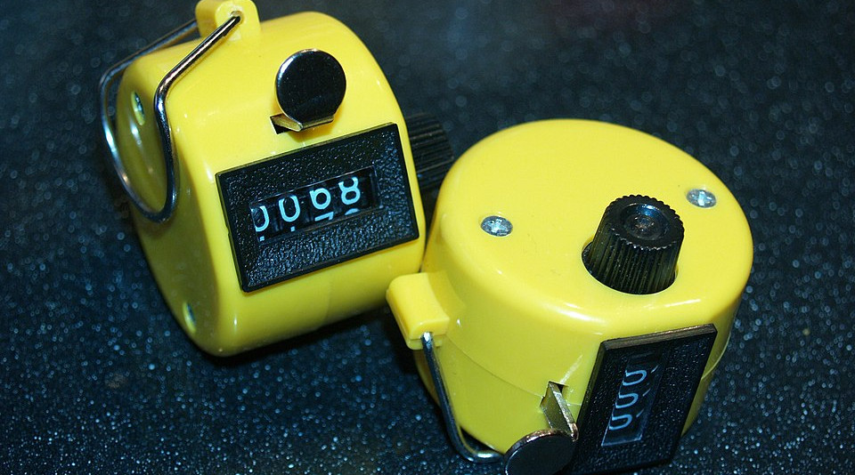
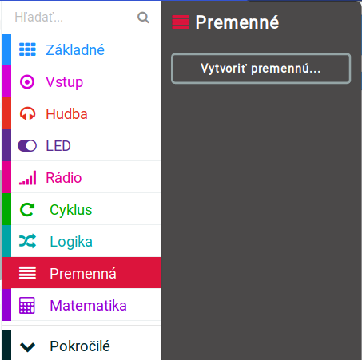
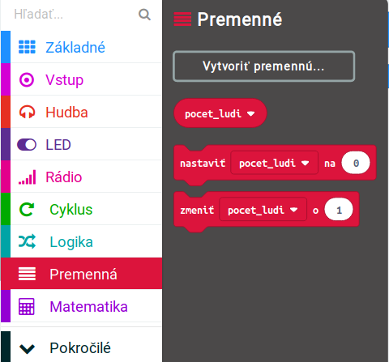

Title:   Počítadlo ľudí
Subtitle:   Objavujeme premenné 
Teacher:	True

# Počítadlo ľudí
## Objavujeme premenné

// LEFT



// RIGHT

<div markdown="1" class="lection-desc">
V tejto lekcii si vytvoríš užitočnú pomôcku – počítadlo ľudí. Tie využívajú napríklad na festivaloch, podujatiach
či diskotékach, aby organizátori vedeli, koľko ľudí pustili dnu.
</div>

**Potrebné pomôcky:**  
BBC micro:bit, USB kábel, batéria k micro:bitu, počítač pripojený k internetu

Pracovať budeme v online prostredí [makecode.microbit.org](https://makecode.microbit.org/)

// END

!!! primary "Ručné počítadlo ľudí"

	Ručné počítadlo sa často využíva na festivaloch, podujatiach a diskotékach, aby organizátori presne vedeli,
	koľko ľudí majú vo vnútri a aby tam nevpustili príliš veľa ľudí naraz. V praxi to vyzerá tak, že vždy, keď ochrankár
	pri vstupe vpustí jedného človeka, zvýši si číslo na počítadle a keď niekto vyjde, číslo si zníži.
	Vždy tak presne vie, koľko ľudí má vo vnútri. Takéto počítadlo by sa dalo použiť napríklad aj v škole počas
	školskej akadémie.

### Premenná

// LEFT

Počas podujatia sa počet ľudí mení, niekedy ľudia prichádzajú (číslo sa zväčšuje)
a potom zas odchádzajú (číslo sa zmenšuje). Toto číslo si nejako na micro:bite musíme zapamätať.
To vieme spraviť pomocou premenných. Premenná sa dá predstaviť ako krabička, do ktorej si uložíme
akúkoľvek informáciu – v našom prípade počet ľudí. Počet ľudí uložený v premennej môžeme kedykoľvek
zväčšovať alebo zmenšovať, podľa toho, ako ľudia vchádajú a vychádzajú.

Túto premennú na začiatku nášho programu nastavíme na nulu, keďže predpokladáme,
že začíname počítať ešte v okamihu, keď žiaden účastník nie je vo vnútri.

// RIGHT



// END

// NEWPAGE

// LEFT

Premenné majú v prostredí MakeCode vlastnú kategóriu `Premenná`. Prostredníctvom tejto kategórie je možné vytvoriť si jednu alebo aj viac
premennych a ľubovoľne si ich pomenovávať. Pre naše počítadlo klikneme na tlačidlo `Vytvoriť premennú`
a následne zadáme názov novej premennej, napríklad _"pocet_ludi"_.
Po jej vytvorení sa nám zobrazia 3 bloky:

*   Okrúhly blok _"pocet_ludi"_, ktorý reprezentuje samotnú premennú. Využívať ho budeme napríklad vtedy, keď budeme chcieť vypísať číslo v premennej na obrazovku. 
*   Príkaz na nastavenie premennej na nejaké dané číslo.
*   Príkaz na zmenu čísla – hodnoty premennej, – vďaka ktorému vieme pripočítavať a odpočítavať z premennej.


// RIGHT



// END

### Nastavenie počítadla na nula a zobrazenie počtu ľudí

// LEFT

V predchádzajúcom kroku sme si premennú vytvorili, no ešte v nej nič nie je. My chceme, aby naše počítadlo začalo
na čísle 0, a preto pri spustení micro:bitu zavoláme príkaz `nastaviť pocet_ludi na 0`.
Príkaz vložíme do príkazu `počas spustenia`, keďže nastaviť na nulu chceme počítadlo iba raz.

// RIGHT

```makecode
_7MpJjyDX0Kv4
```

// END

// LEFT

Následne ešte pridáme micro:bitu možnosť zobrazovať aktuálny počet ľudí (momentálne je to nula ľudí).
Spraviť to môžeme rôznymi spôsobmi, ale povedzme si, že chceme zobraziť počet ľudí potrasením.
Použijeme teda príkaz `keď potrasenie`, do ktorého vložíme príkaz `zobraziť číslo` (pozor, dôležité je použiť
príkaz `zobraziť číslo` a nie `zobraziť reťazec`). Doň stačí už len vložiť našu premennú (červený oválny blok
`pocet_ludi` nájdeš v sekcii `Premenná`, ale iba ak sme takúto premennú najprv vytvorili).

// RIGHT

```makecode
_Jq58qmUKzPPq
```

// END

Program si odskúšaj na micro:bite alebo v simulátore – vždy na potrasenie by ti mal zobraziť číslo nula.


### Prichádzajúci a odchádzajúci ľudia

// LEFT

K počítadlu nám chýba už len málo – potrebujeme naprogramovať micro:bit tak, aby pri stlačení tlačidla A
pripočítal jedného človeka a pri stlačení tlačidla B odpočítal jedného človeka. To spravíme pomocou
príkazu `zmeniť pocet_ludi o 1`. Ak máme vytvorených viacero premenných, je treba zvoliť správnu premennú
na pripočítanie/odpočítanie kliknutím na malú bielu šípku. Odpočítavanie robíme analogicky,
avšak meníme nie o `1`, ale o `-1`.

Teraz by naše počítadlo malo fungovať naplno. Začíname na nule, tlačidlami pripočítavame a odpočítavame ľudí
a keď chceme aktuálny počet ľudí zobraziť, jednoducho potrasieme micro:bitom.
Najprv si funkcionalitu odskúšaj v simulátore a až následne nahraj kód do svojho BBC micro:bitu.


// RIGHT

```makecode
_bWD7MDg3AeXU
```

**Ak ti micro:bit nezobrazuje aktuálny počet ľudí správne, skús ním potriasť**.

// END


// NEWPAGE

!!! primary "Vynulovanie počítadla"
	Ako vynulujeme počítadlo? Stačí stlačiť tlačidlo _RESET_. Keďže micro:bit pri stlačení _RESET_ spustí kód odznovu,
	spustí sa aj príkaz `pri spustení nastav pocet_ludi na 0`. 

!!! info "Ešte lepšie počítadlo"
    Počítadlo môžeš ešte rôznymi spôsobmi zlepšiť, napríkad:

    *   Po zatrasení zobrazuje počet osôb iba 1 sekundu, následne sa obrazovka vyčistí.
    *   Pri každom jednom pripočítaní/odpočítaní sa zobrazí nový počet ľudí aj na obrazovke.** **


#### Pamätá si micro:bit hodnotu premennej?
To, že pri stlačení tlačidla RESET sa premenná vynuluje, už vieme. Zapamätá si ale micro:bit premennú,
keď ho odpojíme a znovu pripojíme k batérii/USB káblu? Odpoveď je nie, a nie je to kvôli príkazu
`počas spustenia`. BBC micro:bit si žiadne premenné pri vypnutí a zapnutí nezapamätá. Je to kvôli tomu, kam si micro:bit
ukladá premenné – do RAM pamäte. To je špeciálna pamäť, ktorá sa vždy pri vypnutí vymaže. Takže keď znovu zapneme
micro:bit, premenné sú prázdne a micro:bit im musí nastaviť nové hodnoty. Prečo sa potom ale samotný kód, ktorý do
micro:bitu nahrávame, tiež nevymaže? Pretože ten sa ukladá do _FLASH_ pamäte, ktorá zostane nezmenená aj pri vypnutí
a zapnutí. Vďaka tomu si micro:bit dokáže zapamätať, čo sme doň naprogramovali.

Klasické počítače pracujú na podobnom princípe – tiež majú RAM pamäť, do ktorej si ukladajú údaje, ktoré sa pri vypnutí
počítača vymažú. Namiesto _FLASH_ pamäte ale využívajú pevné disky (anglicky hard drive disk, skratka HDD).


// LEFT
#### Nekonečné počítadlo

Pomocou premenných sa dá na micro:bite vytvoriť aj nekonečné počítadlo – program, ktorý na micro:bite bude postupne
zobrazovať čísla od jedna po nekonečno. Skús taký program napísať a odskúšať na micro:bite.
Medzi zobrazeniami čísel daj vždy pauzu 1000ms.

// RIGHT

```makecode
_ajW7rhai62q4
```

// END
    
### Zhrnutie kapitoly
V tejto kapitole sme sa naučili používať premenné a vytvoriť pomocou nich z micro:bitu počítadlo ľudí. Premenné majú
ale oveľa väčšie využitie ako len počítadlá ľudí – premenné sú jedným z najzákladnejších konceptov v programovaní
a určite ich budeš ešte využívať. Okrem počtu ľudí doň môžeš uložiť takmer čokoľvek – text, číslo, viac čísel,
obrázky atď.

!!! primary "Záverečné otázky"
    *   Aký je rozdiel medzi RAM a FLASH pamäťou?
    *   Ukladajú sa premenné do RAM pamäte alebo do FLASH pamäte?
    *   Ako vytvorím novú premennú v prostredí MakeCode?