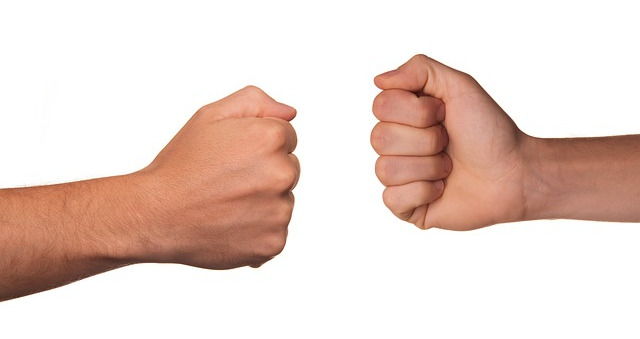

Title:   Kameň, papier, nožnice
Subtitle:    Sprav si s kamarátmi turnaj
Teacher:  True

# Kameň, papier, nožnice
## Sprav si s kamarátmi turnaj

// LEFT



// RIGHT

<div markdown="1" class="lection-desc">
V tejto lekcii si z micro:bitu spravíme pomôcku na hru Kameň, papier, nožnice.
</div>

**Potrebné pomôcky:**  
BBC micro:bit, USB kábel, batéria k micro:bitu, počítač pripojený k internetu

Pracovať budeme v online prostredí [makecode.microbit.org](https://makecode.microbit.org/)

// END


// LEFT

#### Náhodné čísla na micro:bite
Základom elektronickej pomôcky pre hru Kameň, papier nožnice je náhoda – konkrétne náhodné vyberanie spomedzi kameňa, papiera a nožníc. V jednej z predchádzajúcich lekcií sme už s generovaním náhodných čísel pracovali (konkrétne v lekcii Senzor pohybu).

!!! primary "Generovanie náhodných čísel"
    Náhodné čísla na micro:bite získame príkazom `vybrať náhodne od 0 do 10` z kategórie `Matematika`. Rozsah, z ktorého micro:bit vyberá náhodné čísla, vieme ľubovoľne upraviť (napr. aby vyberal náhodné čísla od 1 do 3).


Keďže v hre Kameň, papier, nožnice máme 3 rôzne symboly, náš kód bude pri potrasení náhodne generovať číslo od 1 do 3 a podľa toho zobrazovať adekvátny symbol. Najprv si skúsime náhodné číslo vygenerovať, uložiť ho do premennej `ruka` a vypísať na displej micro:bitu (kód nižšie). Nezabudnite si najprv premennú `ruka` vytvoriť v kategórii "Premenné".

```makecode
_CbUcyz5osWEF
```


#### Symboly namiesto čísel

Predcházajúci kód síce náhodne generuje čísla, ale my by sme namiesto nich chceli na micro:bite zobrazovať symboly. Na to použijeme príkaz `ak pravda potom` z kategórie "Logika", ktorý čísla premení na obrázky, konkrétne:

* Pri čísle 1 zobrazí papier.
* Pri čísle 2 zobrazí kameň.
* Pri čísle 3 zobrazí nožnice.


// RIGHT

Výsledný program:

```makecode
_bWMKT2TKR1Tz
```

// END

// NEWPAGE

### Pridanie počítadla výhier

// LEFT

Micro:bit síce už máme naprogramovaný, ale existuje možnosť, ako program ešte vylepšiť – pridaním počítadla výhier. Využiť by sme ho mohli v turnaji so spolužiakmi alebo kamarátmi. Ako také počítadlo funguje? Počas spustenia micro:bitu nastaví premennú `vyhry` na nula. Vždy, keď vyhráme v hre Kameň, papier, nožnice, stlačíme tlačidlo A, čím sa nám pripočíta bod. Ak by sme chceli zobraziť aktuálny počet bodov, stlačíme tlačidlo B. Vedľa nájdete doplnený program.

Ako počítadlo vynulovať? Stlačí stlačiť tlačidlo RESET na zadnej strane zariadenia.

!!! primary "Turnaj si môžete zahrať <br/>viacerými spôsobmi"
    * Hráči si nájdu dvojicu a zahrajú si hru. Hráč, ktorý prehrá, vypadne a prestane hrať. Hráč, ktorý vyhrá, si pripočíta výhru na micro:bite stlačením tlačidla A a nájde si ďalšieho spoluhráča, ktorý ešte nevypadol, na ďalšiu hru. Hra sa končí, keď zostane už iba posledný hráč, avšak vyhráva ten, kto má najvyšší počet výhier.
    * Hráči v danom časovom intervale (napr. za 1 minútu) majú za úlohu vyhrať čo najviac hier s čo najviac spoluhráčmi. V tejto hre sa nevypadáva, avšak nie je možné hrať s tým istým spoluhráčom 2-krát za sebou. Vyhráva hráč, ktorý má po skončení turnaja najviac víťazstiev.

Keďže v turnaji sme všetci féroví, body si pripočítavame, iba ak naozaj vyhráme.
 
// RIGHT

```makecode-no-link
_PvMHTqLMhXxu
```

```makecode-no-link
_6vz0tmi9JiEE
```

```makecode-link-only
_h5AXtUieqWwg
```

// END