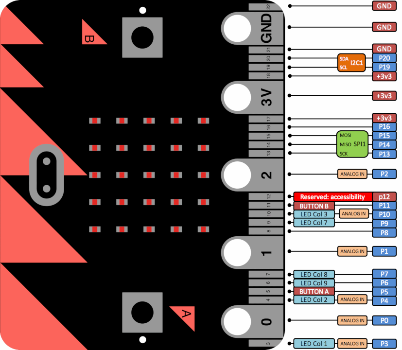
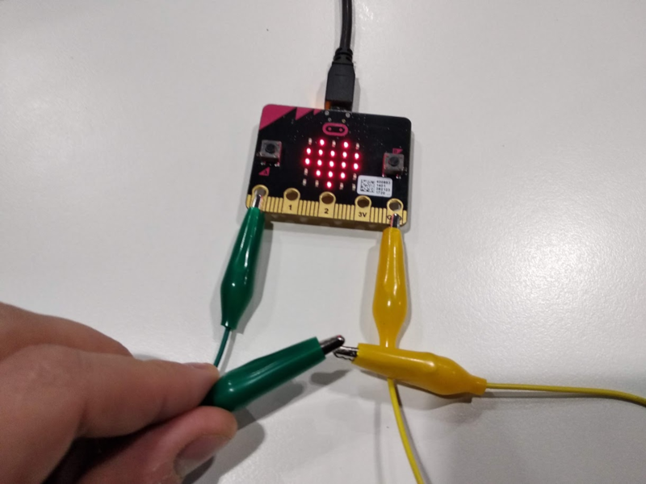
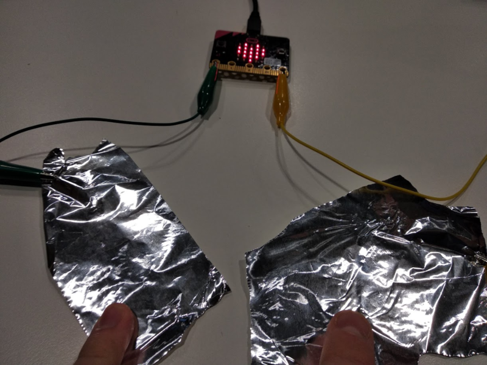
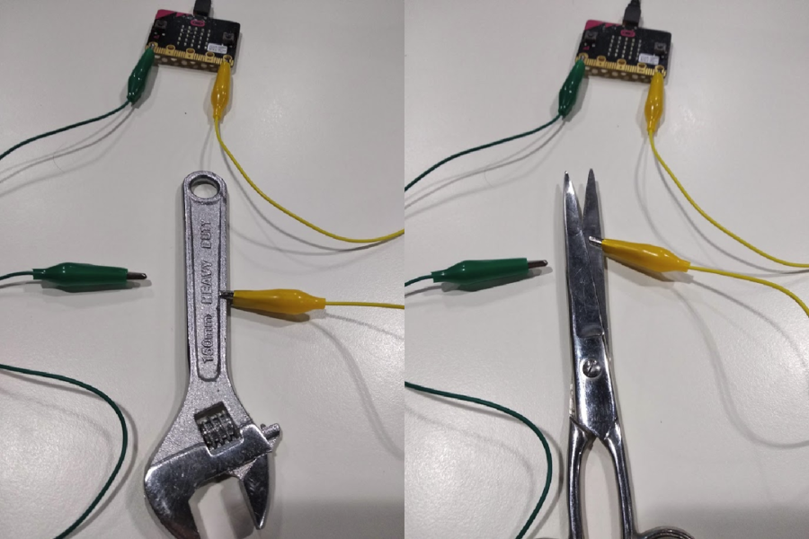

Title:   Vodivosť materiálov
Teacher:	True

# Vodivosť materiálov
## Elektrické obvody

// LEFT


// RIGHT

*Elektrická vodivosť materiálov určuje, či a ako dobre nimi prechádza elektrický prúd.*

**Potrebné pomôcky:**  
BBC micro:bit, USB kábel, batérie k micro:bitu, počítač pripojený k internetu, alobal, krokosvorkové káble,
rôzne vodivé a nevodivé predmety (napr. kovový príbor, kovové nožnice, neizolovaný drôt, izolovaný drôt, atď.) 

Pracovať budeme v online prostredí [makecode.microbit.org](https://makecode.microbit.org/)

// END


### Vodivosť materiálov

// LEFT

Elektrická vodivosť materiálov určuje, či a ako dobre nimi prechádza elektrický prúd. To, či je niečo vodivé vieme zistiť
relatívne jednoducho - skúsime cez to pustiť prúd a potom meriame, či prešiel. Na to, aby sme vedeli micro:bitom
zisťovať vodivosť napríklad alobalu, musíme najprv nejako z micro:bitu pustiť prúd do kúsku alobalu. To vieme spraviť
pomocou kolíkov. Kolíky sú malé kovové plôšky nas spodnej strane micro:bitu
(anglický názov je “Pin”). Na micro:bite sa nachádza 5 väčších kolíkov s označením *0*, *1*, *2*, *3V* a *GND*.

*   `GND` - Zem (z anglického “ground”), dá sa predstaviť ak “mínusová/záporná časť batérie”. Na tomto pine je vždy zem.
*   `3V` - napájania na 3 volty, dá sa predstaviť ak “plusová/kladná časť batérie”. Na tomto pine sú vždy 3 volty.
*   `0`, `1` a `2` - toto sú programovateľné vstupy/výstupy a vďaka nim vie micro:bit komunikovať s okolitým svetom,
    ovládať ho a snímať ho. Tieto kolíky budeme programovať.

// RIGHT




Zdroj: [https://makecode.microbit.org/device/pins](https://makecode.microbit.org/device/pins) 

// END


Medzi týmito 5 veľkými kolíkmi sa nachádza množstvo malých. Každý z nich má svoj účel - niektoré slúžia ako napájanie
(`GND` / `3V`) a niektoré sú programovateľné vstupy/výstupy. Sú malé pre to, aby sa zmestili na micro:bit. Ak by sme ich
chceli použiť, musíme použiť špeciálne zariadenia, do ktorých micro:bit zasunieme. To ale teraz nebudeme potrebovať.

### Snímanie zatvoreného obvodu na micro:bite

// LEFT

Obvody sa na micro:bite dajú zapájať rôznymi spôsobmi, ale my budeme púšťať prúd z kolíku `GND` a snímať ho kolíkom `0`.
Na snímanie použijeme príkaz `keď sa kolík P0 stlačí` z kategórie *Vstup*. Vždy, keď privedieme prúd ku kolíku `0`,
zobrazíme na chvíľu na obrazovke srdiečko. 

// RIGHT

```makecode
_Pmi8TjDPPfPg
```

// END

// NEWPAGE

// LEFT

Fyzické zapojenie spravíme krokosvorkovými káblikmi. To sú obyčajné elektrické kábliky, ktoré majú na konci "krokodílku" - kovový konektor. Síce majú
rôzne farby, ale tie slúžia iba na to, aby sme ľahšie vedeli rozlíšiť, ktorý káblik ide kam. Inak fungujú všetky rovnako.

Po naprogramovaní micro:bitu pripoj jeden koniec krokosvorkového kábla na kolík `GND`. Druhý koniec drž v ruke a iba na krátko sa sa ním
dotkni kolíka `0`. Vždy, keď sa obvod uzatvorí a otvorí tak by sa na micro:bite malo zobraziť srdiečko (tak ako je
na obrázku nižšie.)

// RIGHT


// END

!!! danger "Snímanie vodivosti mi nefunguje správne"
    * Je možné, že snímanie nebude fungovať vždy správne a spoľahlivo v prípade, že je micro:bit pripojený k počítaču.
      Skús preto radšej odpojiť micro:bit z USB kábla a napájať ho batériami.
    * Je dôležité, aby sa krokosvorka nedotýkala žiadneho iného kolíka okrem tých, ku ktorým má byť pripojená.
      Pre istotu si skontroluj, či máš všetko zapojené dobre (a trošku pohýb krokosvorkami).


### Alobalové elektródy a človek ako súčasť obvodu

// LEFT



V ďalšom kroku použijeme na uzatvorenie obvodu 2 káble. Jeden pripojíme ku kolíku `0` a druhý ku kolíku `GND`.
Program z predchádzajúceho kroku nemeníme.
Dotykom ich voľných koncov by sme mali na micro:bite zobrazovať srdiečko.

// RIGHT



Na voľné konce pripojených dvoch krokosvorkových káblov pripevníme dva kúsky alobalu tak, aby sa nedotýkali (podľa
obrázku). Program nemeníme.

// END
 
 Vyskúšaj:

* Skús k sebe priblížiť oba kúsky alobalov tak, aby sa dotkli. Potom ich znovu daj od seba.
* Zober tretí káblik a prepoj ním 2 kúsky alobalu. Potom ho daj preč.
* Jednou rukou drž prvý kúskok alobalu, pripojený ku kolíku `GND`, a druhou rukou sa iba krátko dotkni druhého kúska alobalu (ktorý je pripojený ku kolíku `0`). 

Pri všetkých troch spôsoboch prepojenia obvodu by sa malo rozsvietiť na displeji srdiečko.

// NEWPAGE


Prečo sa srdiečko zobrazilo aj keď sme sa alobalov dotýkali prstami? Je to spôsobené tým, že naše telo je tiež vodivé. Práve kvôli vodivosti
ľudského tela je nebezpečné dotýkať sa elektrických káblov v zásuvke. Nie je potom ale nebezpečné dotýkať sa aj micro:bitu?
Odpoveď je nie, pretože napätie a najmä prúd prechádzajúci telom pri tejto aktivite je tak malý, že nehrozí žiadne
nebezpečenstvo. Ak by sme ale takto uzatvorili obvod v klasickej zásuvke, napätie aj prúd by boli väčšie a to by znamenalo
smrteľné nebezpečenstvo.


// LEFT

#### Rôzne vodivé a nevodivé materiály

Skús alobal nahradiť inými predmetmi a zisti, ktoré z nich sú vodivé.

Sprav si tabuľku, do ktorej budeš zapisovať, ktoré predmety sú vodivé a ktoré nie. Vyskúšaj čo najviac predmetov, ktoré
nájdeš v domácnosti.

Napríklad *mince, nožnice, platový príbor, kovový príbor, papier, atď.*

// RIGHT



// END

!!! primary "Živá reťaz"
	Keď sa dá uzatvoriť elektrický obvod jedným človekom, vieme obvod uzatvoriť aj cez viacero ľudí? Vyskúšaj - zavolaj si
	niekoho, kto ti pomôže, následne chyť jednou rukou kúsok alobalu, a tvoj pomocník chytí jednou rukou druhý kúsok alobalu.
	Keď sa na chvíľu voľnými rukami dotknete, malo by sa zobraziť srdiečko.

	Skús zistiť, cez koľko najviac ľudí dokážeš uzatvoriť obvod.