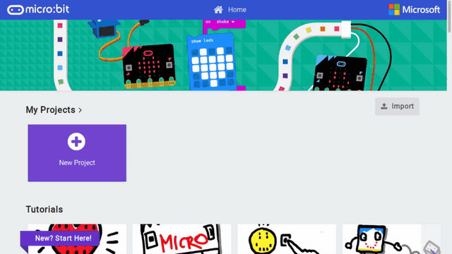
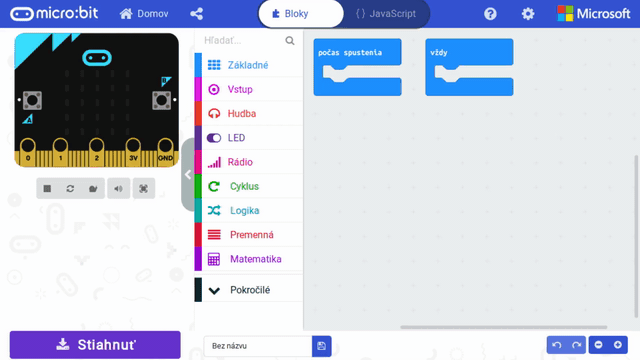

*Táto aktivita slúži na zoznámenie sa s BBC micro:bit - čo to vlastne je, čo s ním vieme spraviť a ako ho môžeme
programovať. Naučíme sa taktiež tvoriť program v prostredí MakeCode a nahrávať ho na micro:bit - našim prvým programom
bude tvorba digitálnej menovky, ktorá bude zobrazovať naše meno. Následne do programu ešte pridáme obrázky.*


**Potrebné pomôcky:**  
BBC micro:bit, USB kábel, batériu k micro:bitu, počítač pripojený k internetu

---

**Obsah aktivity:**

[TOC]

---

## Úvod k mikroprocesorom
Klasický procesor poznáš z počítačov - je "mozgom" každého počítaču, keďže všetky výpočty sa dejú práve v ňom. K nemu
je potom pripojená pamäť, displej, klávesnica, atď.

Mikroprocesor je veľmi podobný klasickému procesoru, až na jeden rozdiel - je oveľa menší. Tým pádom nie je ani tak
výkonný, čo nám ale väčšinou nevadí. Využíva sa napríklad:

* v práčke mikroprocesor ovláda čerpanie vody a motor práčky
* vo výťahu mikroprocesor "počúva", aké tlačidlá stlačíme a podľa toho posiela výťah na jednotlivé poschodia,
  kde vždy otvorí a zatvorí dvere
* v inteligentných (smart) hodinkách mikroprocesor zobrazuje na displeji jednotlivé aplikácie
* v zabezpečovacom systéme mikroprocesor pomocou senzorov pohybu zisťuje, či je v dome nejaký pohyb, a následne spustí
  alarm a zašle SMS správu
  
Mikroprocesory väčšinou interagujú s okolím. Táto interakcia by sa dala zjednodušene rozdeliť na **Vstupy**
a **Výstupy** z mikroprocesora.

| Vstupy do mikroprocesora | Výstupy z mikroprocesora |
|--------|---------|
| Vypínače | Ovládanie svetiel |
|  Senzory svetla | Ovládanie motorov  |
|  Senzory pohybu | Spustenie alarmu  |
|  Teplomer | Ovládanie čerpadla  |
|  Senzory pohybu |  Vypisovanie na displeji |

Takéto rôzne vstupy a výstupy budeme používať na tvorbu hardvérových projektov.

## Predprogramovaný micro:bit

Ak držíš v ruke úplne nový micro:bit, pravdepodobne má na sebe nahratý špeciálny program, vďaka ktorému si môžeš vyskúšať,
čo všetko micro:bit dokáže. Zistíš to tak, že po zapojení micro:bitu k počítaču pomocou klasického USB micro kábla
sa ti na obrazovke micro:bitu začne vypisovať písmeno A spolu so šípkou vľavo.

Ak ale na micro:bite tento program nemáš, nezúfaj, veľmi jednoducho ho vieme stiahnuť.
Z [tohto odkazu](https://support.microbit.org/helpdesk/attachments/19033089764) si stiahni súbor, ktorý sa nazýva
*OutOfBoxExperience-v2.hex*. Potom pripoj svoj micro:bit k počítaču - ak si pozorne všimneš, počítač ti oznámi, že
sa k nemu pripojilo USB úložisko s názom **MICROBIT**. Teraz už len stačí stiahnutý program *OutOfBoxExperience-v2.hex*
prekopírovať na úložisko **MICROBIT**. Na chvíľu by mala začať blikať žltá LED dióda na zadnej strane micro:bitu, a po
jej doblikaní sa na micro:bit displeji zobrazí písmeno A spolu so šípkou vľavo.

Ak už máš program na micro:bite spustený, vyskúšaj si ho presť bez pomoci z tohto návodu (jednotlivé mini úlohy
sú celkom intuitívne). Ak by si potreboval/a pomôcť, tu máš návod:

* Najprv treba na micro:bite stlačiť tlačidlo A (tlačidlo treba stlačiť poriadne)
* Následne treba stlačiť tlačidlo B
* Poriadne zatrasenie micro:bitom (čím viac ním potrasieš, tým viac sa rozžiari LED displej)
* Spustí sa hra, v ktorej pomocou nakláňania micro:bitu "naháňaš" blikajúcu bodku
* Keď úspešne prejdeš hrou, micro:bit ti bude zobrazovať animáciu srdiečka. Ak ale teraz stlačíš obe tlačidlá naraz,
  spustíš skrytú hru - hadíka.
  
Ak chceš spustiť hru od začiatku, stlač tlačidlo *RESET* na zadnej strane dosky.

## Skúmanie micro:bitu

Zopár senzorov, ako napríklad tlačidlá a senzor naklonenia/zatrasenia sme si v predchádzajúcej mini-hre vyskúšali, ale
aké ďalšie súčiastky micro:bit obsahuje? Čiastočne nám napovie aj sa samotný micro:bit - skús nájsť čo najviac
názvov senzorov, ktoré sú na doske vypísané.


**Predná strana**  

* **2 tlačidlá** - micro:bit má 2 tlačidlá na prednej strane, ktoré môžeŠ naprogramovať aby spúšťali nejakú časť kódu :-)
                 tlačidlá sú označené tlačidlami  `A` a `B`
* **5x5 LED displej** - 25 červených LED diód vieš využiť na zobrazovanie obrázkov, textu a čísel. Zároveň ale slúžia
                      ako senzor - môžeš nimi merať intenzitu svetla, ktoré dopadá na micro:bit


**Zadná strana**  

* **Anténa** - micro:bit vie komunikovať 2 spôsobmi - buď s ďalšími micro:bitmi pomocou rádiovej komunikácie, alebo
               s inými zariadeniami pomocou Bluetooth. Klasické rádio si na ňom ale nenaladíš :-(
* **Procesor** - mozgom celého microbitu je mikroprocesor, ktorý vykonáva kód, ktorý naň nahráme. Obsahuje aj vbudovaný
                 teplomer, ktorý ale nemeria teplotu prostredia, ale teplotu procesoru
* **RESET tlačidlo** - toto tlačidlo reštartuje micro:bit a spustí nahratý program od začiatku
* **micro USB konektor** - slúži na nahrávanie programov do micro:bitu a aj na napájanie, aby sme nemuseli míňať
                           batérie
* **Jedna žltá LED dióda** - indikuje, že micro:bit je pripojený k počítaču cez USB kábel, a pri nahrávaní programu
                             bliká
* **Konektor batérie** - namiesto USB kábla môžeme na napájanie micro:bitu použiť aj dve AAA batérie, ktoré pripojíme
                         k micro:bitu pomocou špeciálneho konektoru - tým pádom môžeš svoj micro:bit zobrať von z domu
* **Kompas** - magnetický senzor meria silu magnetického poľa a okrem svetových strán ním dokážete určiť, či je v 
               blízkosti magnet
* **Akcelerometer** - sníma naklonenie a pohyby micro:bitu

**Vstupno/výstupné piny**
Na spodnej strane sú malé kovové plôšky, niektoré označené, iné nie. Slúžia na prepojenie micro:bitu s ďalšíme senzormi
a aktormi - napríklad motorčekmi či senzormi vlhkosti pôdy. Pripojiť sa k nim dá takmer čokoľvek.

Niektoré z pinov sú označené:

* `0`, `1` a `2` - tieto piný sú programovateľné, a vieš vďaka nim čítať údaje s pripojených senzorov alebo
                 ovládať pripojené aktory
* `GND` - skratke od GROUND, čiže po Slovensky ZEM - externé senzory k nemu pripájame, aby sme ich uzemnili
* `3V` - tento pin má privedené 3 volty a slúži na napájanie externých senzorov

## Vypísanie textu na displeji

Náš prvý program vyskúšame spraviť v online prostredí [makecode.microbit.org](https://makecode.microbit.org/).
V ňom si vytvoríme digitálnu "menovku", ktorá bude zobrazovať naše meno a aj nejaké obrázky. Bude nám k tomu stačiť iba
BBC micro:bit a micro USB kábel.

Postup programovania v MakeCode:

* Vytvorenie nového projektu
* Naprogramovanie programu
* Overenie správnosti v simulátori (v ľavej časti prostredia MakeCode)
* Stiahnutie na BBC micro:bit

V prostredí [MakeCode](https://makecode.microbit.org/) klikni na *Nový projekt*. V prípade, že sa prostredie otvorí
v anglickom jazyku, prenúť ho vieš kliknutím na ozubené koliesko hore vpravo, a v sekcii *Language* vyber
*Slovenčinu*.



V našom prostredí máme 3 časti:

* vpravo je miesto na tvorbu nášho programu
* v strede je knižnica príkazov, ktoré môžeme použiť
* na ľavej strane je simulátor

Keďže cheme vytvoriť menovku, musíme na displej vypísať naše meno. To spravíš príkazom `zobraziť reťazec` z kategórie
`Základné`, ktorý vložíš do príkazu *vždy*. Následne doň vpíš svoje krstné meno, ktoré by sa malo na simulátore začať zobrazovať.

!!! success "Reťazec"
    Textový reťazec (anglicky "string") je postupnosť znakov (písmen, medzier, čísiel, atď.) V programovaní
    ho používame keď chceme pracovať s textom (v tejto aktivite je tým textom naše meno).



Simulátor je veľmi praktická pomôcka, ktorá ušetrí množstvo času - vždy si v ňom svoj program skontroluj ešte pred
nahraním na samotný micro:bit.

Keď sme s našim programom spokojní, môžme kliknúť na tlačilo *Stiahnuť*, ktoré stiahne program s príponou *.hex* na
počítač.

Posledný krok, ktorý nám zostáva je nahrať novo vytvorený program na samotný micro:bit. Ten si pripoj
k počítaču pomocou klasického micro USB kábla, aký sa bežne používa na mobilné telefóny. V počítači potom uvidíš,
že micro:bit sa pripojil ako USB zariadenie, skoro ako keby to bolo klasické USB úložisko. Naň stačí už len stiahnutý
program s príponou *.hex* skopírovať. Indikačná LEDka na micro:bite by sa mala na chvíľu rozblikať a po chvíľke
začne micro:bit vypisovať tvoje meno.

```makecode
_X85Cks9pj4Ra
```

**Prečo mi nefunguje nahrávanie?**

*   V prvom rade je potrebné skontrolovať USB kábel, prípadne vypojiť a znovu zapojiť USB kábel a znovu vyskúšať nahrať.
*   Má užívateľ na počítači právo pristupovať k USB portom? Toto býva problém najmä na školských počítačoch - vtedy treba
    kontaktovať školského administrátora.
*   Vygenerovaný .hex súbor sa zväčša (podľa nastavenia webového prehliadača) stiahne do adresáru “Downloads”
    (“Prevzaté súbory”). V prípade, že je tento adresár zaplnený inými nepotrebnými súbormi odporúčame nepotrebné
     súbory vymazať, aby si nemusel/a pracne hľadať stiahnuté programy.
   
       
## Zobrazovanie obrázkov

Do nášho programu chceme pridať obrázok pomocou príkazu `zobraziť LED` z kategórie `Základné`. Tento príkaz umožňuje
vyklikať si akýkoľvek obrázok. Skús vyklikať na micro:bite obrázok srdiečka. Tento príkaz vložíme za príkaz `zobraziť
reťazec`

Či sa nám obrázok zobrazuje správne si overíme v simulátore. Až následne sťahujeme program do micro:bitu.


    
```makecode
_f7jFu1UruaHK
```

Druhým spôsobom, ako môžme pridávať obrázky na micro:bit je príkaz `zobraziť ikonu` (kategória `Základné`). Tento príkaz už má preddefinované
nejaké základné obrázky na displeji.


```makecode
_JwgbcRT8P0aD
```
!!! info "Doplňujúce úlohy"
    * Pridaj do programu ďalšie obrázky, prípadne striedaj vypisovanie textu a obrázkov.
    * V programe použi aj vlastné aj predprogramované obrázky.

## Pauzy medzi príkazmi

Naša digitálna menovka momentálne zobrazuje meno a nejaký obrázok. No čo ak by sme chceli, aby obrázok zostal na micro:bite
zobrazený dlhšie - napríklad 15 sekúnd? To sa dá spraviť celkom jednoducho pomocou príkazu `pozastaviť (ms)`
(z kategórie `Základné`). Tento príkaz pozastaví vykonávanie programu na nastavený počet milisekúnd.

!!! success "Milisekundy"
    Milisekunda (skratka ms) je jednotkou času - jedna milisekunda je ticícinou sekundy, čiže jedna sekunda má tisíc
    milisekúnd. Niekoľko príkladov:

    * 500 ms = pol sekundy
    * 2000 ms = dve sekundy
    * 10 000 ms = desať sekúnd    
    
```makecode
_gHx19V3wU6RT
```

!!! primary "Kontrolné otázky"
    * Je jedno, či umiestniš príkaz pozastaviť pred alebo po príkaze `zobraziť LED`? (vyskúšaj)
    * Čo robí micro:bit počas vykonávania príkazu `pozastaviť (ms)`? (nič, iba čaká)
    
## Zhrnutie aktivity
V tejto aktivite sme sa zoznámili s micro:bitom a naprogramovali našu "digitálnu menovku". Ak ju chceš teraz použiť,
môžeš micro:bit odpojiť od USB kábla a pripojiť k micro:bitu batériu. Aj po pripojení k batérií tvoj program zostane uložený
na micro:bite a začne sa automaticky vykonávať.