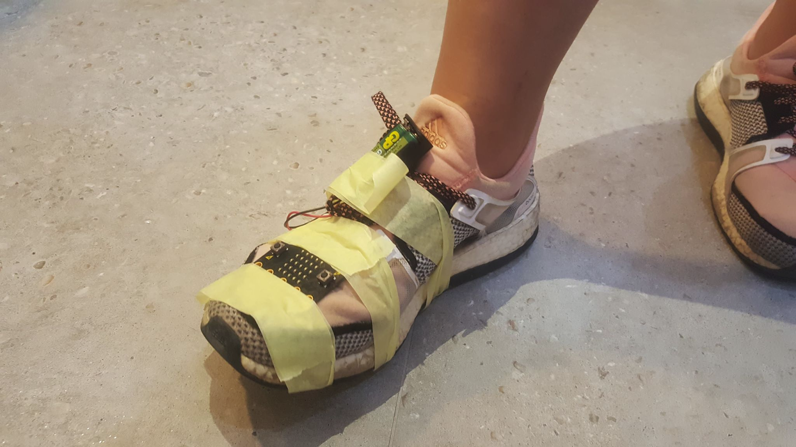

*Poslušne hlásim je matematická hra pre __3 až 4 hráčov__, pričom __sú potrebné 2 micro:bity.__*

<!--

-->

**Potrebné pomôcky:**  
2x BBC micro:bit, USB kábele, batérie k micro:bitu, počítač pripojený k internetu,
čelenka, papierové kartičky s číslami od 1 po 10, lepiaca páska

Pracovať budeme v online prostredí [makecode.microbit.org](https://makecode.microbit.org/)

---

**Obsah aktivity:**

[TOC]

---


## Poslušne hlásim


*Poslušne hlásim!* je jednoduchá matematická hra, ktorá sa bežne hráva s číselnými kartami a je určená pre dvoch hráčov
a jedného rozhodcu. Dvaja hráči si na pokyn rozhodcu, ktorý znie “Poslušne hlásim!”, vyberú číselnú kartu z balíčka
(bez toho, aby sa na ňu pozreli) a držia si ju na čele. Rozhodca, ktorý ako jediný vidí obe karty
sa rozhodne, či vytvorí súčet alebo súčin tých dvoch kariet a potom hráčom oznámi výsledok (ale neoznámi im, či karty
sčítal alebo znásobil). Hráči nevidia svoju kartu, ale vidia kartu protihráča, ktorý si ju tiež drží na čele.
Na základe karty protihráča a výsledku súčtu alebo súčinu čísel ohláseného rozhodcom sa hráči snažia zistiť,
akú kartu držia. Bod získava hráč, ktorý ako prvý správne uhádne, aké číslo má karta, ktorú drží. Po zapísaní získaného
bodu na papier hráči čakajú, kým rozhodca nedá pokyn na vytiahnutie ďalšej číselnej karty. Pokyn znie “Poslušne hlásim!” 

!!! info "Zahraj si _Poslušne hlásim!_"
    Ešte pred tým, ako budeš pokračovať v programovaní micro:bitu, si spolu so spoluhráčmi priprav papierové kartičky
    a zahraj si hru _Poslušne hlásim!_

## Elektronické "číselné kartičky"

Prvou úlohou žiakov je kartičky s číslami nahradiť dvoma micro:bitmi. Tie budú naprogramované veľmi jednoduchým kódom.
Ako vstup si môžu zvoliť ľubovoľný príkaz - či už stlačenie tlačidla, zatrasenie, naklonenie… Zvyšné pravidlá hry
zostávajú nezmenené, stále platí, že žiak nesmie vidieť číslo na svojom micro:bite, ale musí ho uhádnuť.
Hráči vždy čakajú na povel rozhodcu.

```makecode
_UvdVFhUJmErT
```

## Rozhodcovské počítadlo

Aby rozhodca nemusel pracne zapisovať body hráčom, vytvoríme me digitálne počítadlo. Každý hráč začína s nula bodmi,
ak získa hráč číslo 1 bod tak rozhodca stlačí tlačidlo A a pripočíta sa mu jeden bod. Ak získa bod hráč číslo 2 tak
rozhodca stlačí tlačidlo B. Ako ale vypíšime aktuálny stav bodov? Napríklad keď micro:bitom zatrasieme -
pri potrasení micro:bit najprv vypíše počet bodov hráča číslo jeden a následne hráča číslo dva.

Keď hru skončíme a budeš chcieť počítať bodu od znovu, stačí stlačiť tlačidlo *RESET* na zadnej strane zariadenia.

Aktuálny stav si micro:bit bude zapamätávať do premenných “hrac1” a “hrac2”. 

```makecode
_8PgLC7dbbd1X
```

# Čelenka pre micro:bit
Aby hráči hry micro:bit nemuseli držať, môžme si z ľubovoľného materiálu vytvoriť čelenku, ktorá bude micro:bit držať
pevne na hlave. Nové náhodné číslo zobrazí vždy pri naklonení hlavy (použijeme preto príkaz `keď naklonenie vľavo`)

```makecode
_5VE92gaUUd6q 
```

!!! info "Obmeny hry"
    Hru môžeš so spoluhráčmi ľubovoľne obmieňať
    
    *   Namiesto súčinu a súčtu použi súčet a rozdiel, alebo ľubovoľné iné matematické operácie (ak si trúfaš, môžeš
        skúsiť aj  mocniny či modulo).
    *   Hru je možné hrať aj s 3 hráčmi (plus jeden rozhodca). Postup je presne taký istý ako pri 2 hráčoch, každý
        z troch hráčov má micro:bit, ktorý mu vygeneruje náhodné číslo, rozhodca spraví súčin týchto troch čísel
        a povie ho hráčom. Každý hráč vidí zvyšné dve čísla (okrem svojho). Napr.: Žiaci si vytiahnú čísla 2, 3 a 5.
        Rozhodca oznámi číslo 30. Keďže hráč číslo 1 vidí čísla svojich spoluhráčov (3 a 5), správne odpovie číslo 2,
        keďže 2x3x5=30
