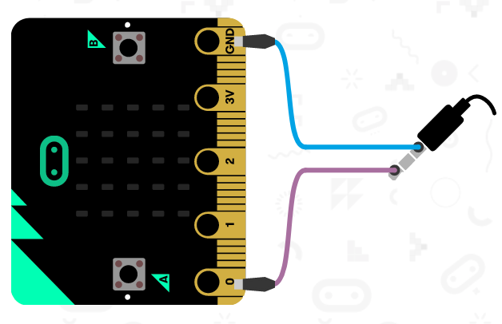
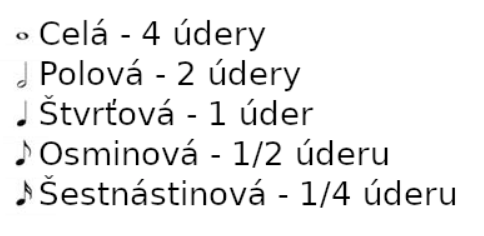
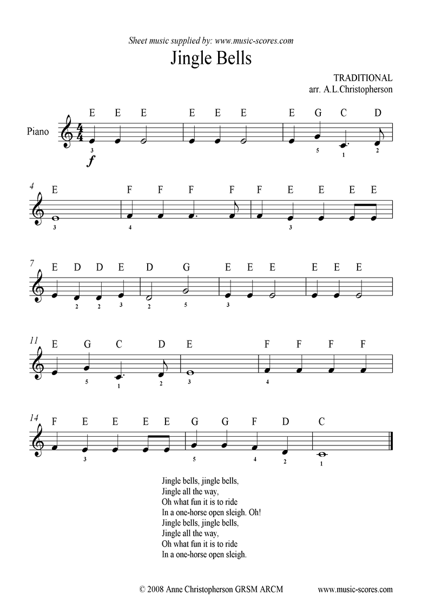

!!! warning "Pracujeme..."
    Táto kapitola je ešte rozpracovaná, zatiaľ tu nájdeš iba základné informácie. V najbližšom čase ju budeme ešte dopĺňať.

BBC micro:bit dokáže prehrávať hudbu na klasických reproduktoroch vďaka posielaniu signálov cez pin 0. Ukážeme si, ako reproduktor zapojiť a ako na ňom prehrávať vlastnú hudbu.

## Pripojenie reproduktoru
Využiť môžeme akýkoľvek reproduktor, ktorý má klasickú koncovku - tá sa nazýva 3,5mm Jack. Ten má obvykle 3 sekcie predelené plastovými krúžkami - prvá časť posiela signál ľavému reprodiktoru, druhá pravému reproduktoru a posledná slúži ako spoločná zem pre oba reproduktory. My budeme s micro:bitom ale prehrávať hudbu iba na jednom reproduktore, a preto pripojíme k micro:bitu prvú sekciu - pre ľavý reproduktor - s Pinom 0 na micro:bite. Piny sú vodivé plôšky na spodnej strane micro:bitu, vďaka ktorým k micro:bitu pripájame rôzne senzory a aktory. Na prepojenie používame krokosvorkový káblik. Nesmieme ešte zabudnúť prepojiť zem (anglicky GROUND). (na konci záber na hotový setup)



## Predprogramovaná hudba

```python
import music

music.play(music.BIRTHDAY)
```

Na programovanie hudby v MicroPythone nám poslúži modul ``music``, (``import music``) v ktorom sa nachádza metóda ``play``, ktorej ako parameter musíme zadať, akú melódiu má prehrať. (``music.play()``) Modul už v sebe obsahuje aj nejaké predprogramované melódie, Mu editor nám napovedá, ako sa volajú. Vyskúšame prehrať napríklad melódiu ``BIRTHDAY`` (``music.play(music.BIRTHDAY)``).

* __music__ - kinižnica na generovanie hudby na _pine 0_
* __music.BIRTHDAY__ - prehrá melódiu BIRTHDAY

micro:bit už má niekoľko predprogramovaných melódií, tie nájdete v  - [dokumentácii (pozri Music)](http://microbit-micropython.readthedocs.io/en/latest/tutorials/music.html)

!!! warning "Nefunguje mi to..."
	Po nahratí na micro:bit by sa nám mala prehrať melódia. V opačnom prípade skúste skontrolovať zapojenie, nakoľko krokosvorky na micro:bite aj na JACK konektore sa môžu ľahko posunúť.


## Písanie vlastnej hudby - Kohútik Jarabý

Teraz sa posunieme ďalej a naprogramujeme si pieseň Kohútik jarabý, tón po tóne. Keď sa pozrieme na noty pre túto pieseň, tak dôležté sú pre nás dve informácie - umiestnenie nôt na čiarach a to, ako vyzerajú. Kým pozícia na čiare určuje tón noty (napríklad C, D, atď), to, ako nota vyzerá určuje trvanie noty (udáva sa v úderoch). Tóny nôt nájdete v tomto prípade vypísané nad každou notou (toto sa štandardne nerobí), trvanie určite podľa tabuľky nižšie. Prvá nota je osminová nota C, a teda bude trvať pol úderu, druhá je osminová nota D, tretia je štvrťová nota E, a tak ďalej.




Teraz už len stačí noty prepísať do MicroPythonu a pomocou funkcie music.play prehrať. Noty si uložíme do zoznamu, čiže premennej, ktorá si pamätá viac informácií, v našom prípade viac nôt. Tento zoznam si pomenujeme ``kohutik`` a do hranatých zátvoriek začneme písať noty. Pre každý notu dáme do úvodzoviek dve informácie - tón noty a dĺžku trvania - oddelené dvojbodkou. Pre prvú not teda zadáme C-čko, a za dvojbodkou jej trvanie. Vieme, že nota by mala byť na pol úderu, no modul music nám, žiaľ, neumožnuje zadať polovičnú hodnotu. Preto všetky hodnoty prenásobíme dvojkou - pre polúderovú osminovú notu zadáme jednotku a pre pre jednoúderovú štvrťovú notu zadáme dvojku. Takto pokračujeme, až vypíšeme celú pieseň, tón po tóne. Napísanú pieseň potom už iba prehráme pomocou ``music.play(kohutik)``.

```python
import music

kohutik = ["C:2", "D:2", "E:4", "F:4", "F:2", "F:2"]
music.play(kohutik)
```

!!! primary "Úloha"
	Pokračuj v prepisovaní nôt a prehraj na micro:bite celú pieseň.

Týmto spôsobom vieme prehrávať na mico:bite prakticky akúkoľvek pieseň. Skúste si napríklad nájsť na internete noty k zvučke od Harry Pottera a prehrať na micro:bite.


## Rolničky





```python
# Piesen Rolnicky
import music

tune = ["E:2", "E:2", "E:4", "E:2", "E:2", "E:4", "E:2", "G:2", "C:3", "D:1",
        "E:8", ]
music.play(tune)
```

!!! primary "Úloha"
	Pokračuj v prepisovaní nôt a prehraj na micro:bite celú pieseň.