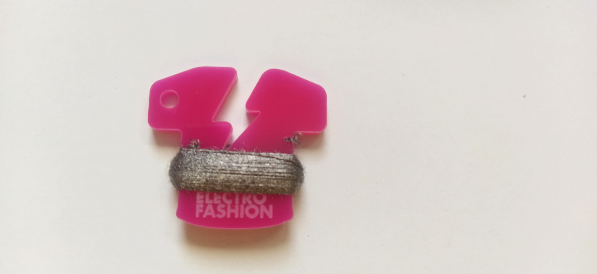
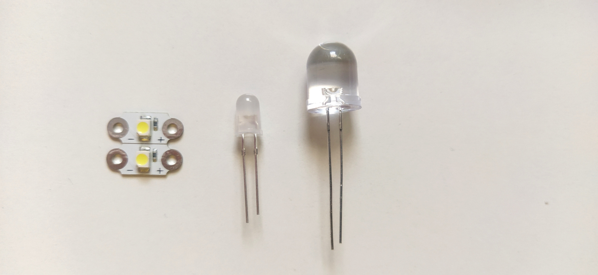
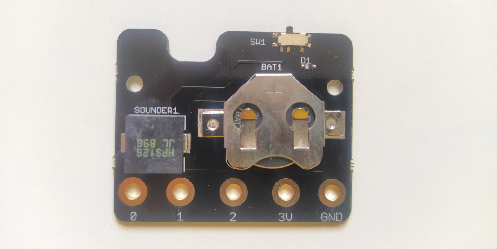

Title:   	Úvod
Teacher:	True

# Úvod
## 	O tomto tutoriáli

// LEFT

// RIGHT

Už ste niekedy nosili na tele alebo oblečení nejakú elektroniku? Možno máte smart hodinky, fitness náramky alebo iné mini elektronické zariadenia, ktoré nosíte na sebe. Nositeľná elektronika môže byť však čokoľvek, kde sa vyskytujú elektrické obvody. Napríklad na tričku.

Predstavme si, že chceme mať svietiace tričko. Čo k tomu potrebujeme? – tričko, BBC micro:bit, rezistor, LED diódu, krokosvorkové káble... bolo by také „káblové tričko“ nositeľné? Asi by nosenie bolo náročné. Preto existuje nositeľná elektronika, ktorá nahrádza bežne dostupnú elektroniku.

// END

### Rozdiely v nositeľnej elektronike

// LEFT

#### Elektrovodivá niť

Je to napríklad elektrovodivá niť. Táto niť nahrádza krokosvorkové káble a je vytvorená väčšina zo strieborných častí či nerezovej ocele. Dá sa ohýbať a keď ju našijeme na oblečenie, drží svoj tvar.

#### LED diódy

Existuje aj ďalší rozdiel v nositeľnej a bežnej elektronike. Sú to LED diódy určené pre šitie na textílie. Aké sú ich základné rozdiely? V prvom rade je to ich veľkosť. LED diódy určené pre šitie sú menšie, ich puzdro nie je tak vypuklé ako pri bežných LED diódach. Existuje však aj ďalší rozdiel, a to nožičky. Všimli ste si, že nositeľné LED diódy nemajú nožičky? Namiesto toho majú na oboch stranách elektrovodivé kruhovité útvary, ktoré sú pomenované plus a mínus. Plus je pre nás „dlhšia nožička“, čiže anóda a „kratšia nožička“, teda katóda, je označená mínus. Okrem týchto vlastností existuje ešte jedna, ktorá je veľmi dôležitá. Pri zapojení bežnej LED diódy zvyčajne potrebujeme rezistor, ktorý pridávame do elektrického obvodu. Pri nositeľnej LED dióde nepotrebujeme žiadne rezistory, pretože sú už automaticky zabudované k ploche, kde sa nachádza LED dióda. Takýmto riešením dostávame veľkú výhodu – nemusíme prišívať zvlášť rezistor a LED diódu, prípadne ich spájkovať.

#### MI:power board (doska so zdrojom napájania)

Tretím najväčším rozdielom je zdroj napätia (batéria). Keďže bežne dostupné AAA batérie sú príliš veľké k nositeľnej elektronike a zároveň sú aj ťažšie, využívame okrúhlu („plochú“) 3V batériu, ktorá je vsadená do MI:power dosky. Doska sa pomocou skrutiek a matiek (obe sú vodivé) pripojí k pinom na micro:bite, čo nám pri šití uľahčí prácu. Navyše, doska neobsahuje len držiak na baterku so spínačom, ale aj malý reproduktor.

// RIGHT

// END
 

// NEWPAGE

### Ako zapájame nositeľnú LED diódu?

Keďže už vieme, že na nositeľných LED diódach máme značenie + a -, stačí, aby sme ich správne zapojili. Plus pripájame k pine 3V alebo programovateľným pinom, napr. „0“, „1“, „2“ na micro:bite. Mínus zapájame vždy k pinu s označením „GND“, teda ground = zem.

!!! Zopakujme si rezistor

	Rezistor je elektronická súčiastka, ktorá limituje množstvo prúdu pretekajúceho obvodom a tým ochráni LEDku od vypálenia. Presná hodnota rezistoru (teda jeho odporu) sa udáva v ohmoch (symbolom je grécka omega Ω) a pre každú LEDku sa vypočítava osobitne podľa parametrov LEDky.

### Nosíme elektronické oblečenie

Keď už vieme, že existuje nositeľná elektronika, musí existovať aj elektronické oblečenie. Ide o oblečenie, kde sa okrem textílií nachádza zdroj napätia (batéria), elektrický obvod a elektronické súčiastky, ktoré spíname. Pokiaľ k nemu pridáme BBC micro:bit, môžeme nositeľnú elektroniku programovať. Poďme si to vyskúšať!

---

!!! primary "Autor a Licencia"
	Autorom tohto materiálu je **Nika Klimová** a je zverejnený pod licenciou [CC BY-SA 4.0](https://creativecommons.org/licenses/by-sa/4.0/), ktorá ti umožňuje používať, upravovať a zdieľať tento materiál akokoľvek uznáš za vhodné, pod podmienkou uvedenia autora a zachovania rovnakej licencie.

	Ak nie je uvedené inak, licencia a autorstvo sa vzťahuje aj na fotografie.