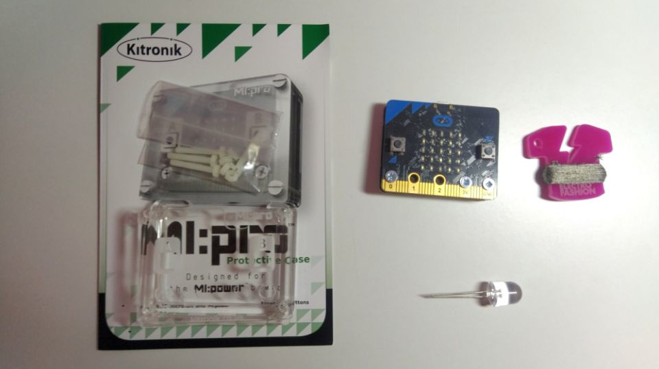
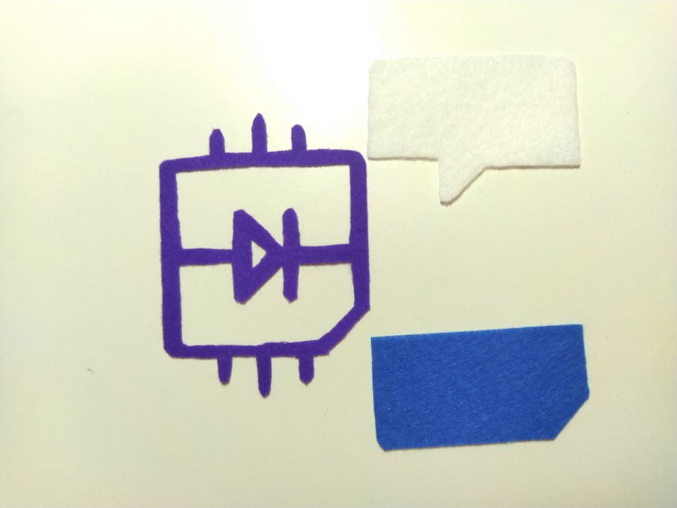
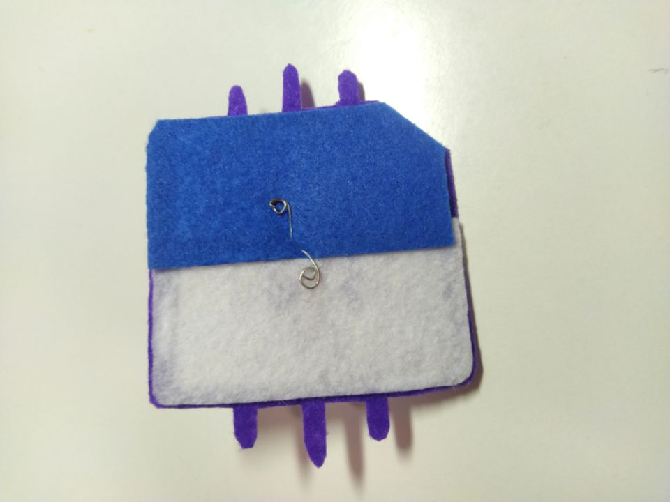
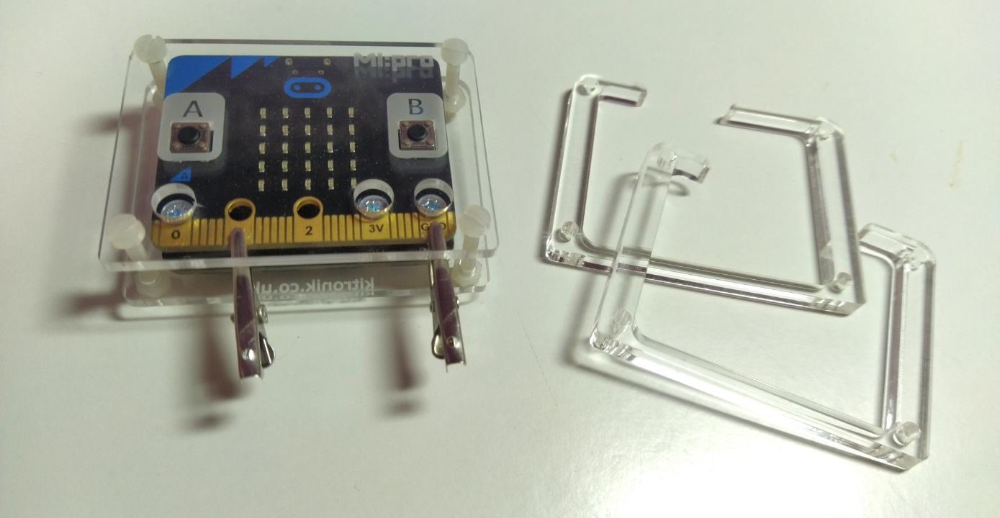

Title:   	Odznak
Teacher:	True

# Odznak
## 	Wearables (nositeľná elektronika)

// LEFT


// RIGHT

Odznaky nosí mnoho ľudí. Vojaci, policajti a hasiči ich nosia kvôli tomu, aby sa videlo, akú hodnosť majú, deti ich nosia kvôli radosti. Odznak o nás môže povedať veľa. Možno sa z neho dozvedieť, akú hudbu máme radi, kto je náš obľúbený idol, či dokonca aké jedlo je podľa nás najlepšie! My si tiež zaslúžime nejaký odznak, nie? Čo tak si jeden vytvoriť? Napríklad odznak Učíme s Hardvérom!

// END

// LEFT

#### Čo budeme potrebovať?

*   plste: biela, modrá, fialová (tmavomodrá)
*   BBC micro:bit
*   USB kábel
*   elektrovodivá niť
*   ihla
*   LED dióda
*   MI:power board
*   MI:pro ochranný obal
*   zicherka
*   obyčajná niť
*   kombinované kliešte

// RIGHT



// END

// LEFT

Najskôr sa pozrime na logo, ktoré chceme vytvoriť. Čo je v ňom? Vidíme tam elektrický obvod, ktorý má v strede značku LED diódy. Čo keby sme LED diódu rozsvietili? Nie je to málo? A čo keby sme prostredníctvom LED diódy komunikovali? Môžeme na to použiť morzeovu abecedu. Stanovme si dnešný cieľ: Vytvoriť odznak Učíme s Hardvérom, ktorý bude mať LED diódu, ktorá bude morzeovou abecedou vysielať nejakú informáciu.

// RIGHT


// END

// LEFT

#### Základné tvary

Najskôr si zoberieme plste a začneme fialovou. Tá bude predstavovať náš základ. Vytlačíme si logo a z fialovej plste ho obstriháme po obvode. Fialová bude značiť elektrický obvod loga, takže do nej potrebujeme urobiť modré a biele prázdne miesta. To je najlepšie vytvoriť pomocou manikúrových nožničiek, ktoré sú veľmi presné. Prekreslíme si perom na fialovú  plsť miesta, ktoré majú byť vystrihnuté (biela a modrá) a následne vystrihneme. 

// RIGHT



// END

// NEWPAGE

// LEFT

Zoberieme si bielu a modrú plsť, z ktorej vystrihneme základné tvary podobajúce sa obdĺžnikom. Musíme však dbať na to, že pri bielej plsti je biela výplň aj v značke LED diódy. Na obrázku možno vidieť už vytvorené tvary. Tie zlepíme v tomto poradí: Modrá plsť je spodok, na ňu sa čiastočne priliepa biela plsť a všetko ukončíme fialovou plsťou vo forme elektrického obvodu.

#### Zapájanie LED diódy

Keďže chceme LED diódou komunikovať morzeovou abecedou, je potrebné, aby bola dostatočne viditeľná. Preto nepoužijeme LED diódu určenú na nositeľnú elektroniku, ale zapojíme si bežnú LED diódu s nožičkami. LED diódu v strede odznaku prepichneme nožičkami, avšak nesmú sa dotýkať! Ubezpečíme sa, ktorá nožička je dlhšia a zapamätáme si ju, prípadne si ju môžeme nejako označiť. Kombinovanými kliešťami potrebujeme z nožičiek vytvoriť kruhy, pretože ich budeme našívať a niť z nich nesmie vypadnúť. Zistíme si, či LED dióda potrebuje rezistor a v prípade potreby ju pripojíme k LED dióde pomocou kombinovaných kliešťov tak, aby koniec jednej nožičky bol kruhovitý.

// RIGHT




// END

// LEFT

#### MI:power ochranný obal

Ochranný obal má dva účely: chráni micro:bit, ktorý už má zapojený mi:power board (vysvetlené v predchádzajúcej lekcii) a predná časť micro:bitu sa stáva plochou, pričom tlačidlá sú stále stlačiteľné. To znamená, že micro:bit sa stane základom pre odznak, ktorý nebude skrčený a vyčnievajúce tlačidlá nebudú tvoriť škaredý dojem, pretože odznak bude na rovnom podklade.

Pri ochrannom obale však musíme niečo pozmeniť. Keďže obal sa skladá zo 4 priesvitných častí, pokiaľ pridáme vnútorné časti (druhá a tretia), znemožníme si tým prístup k pinom a nezapojíme LED diódu. Keď ich vynecháme a použijeme len vonkajšie časti (prvá a štvrtá), na piny môžeme pripojiť krokosvorky.

Následne použijeme elektrovodivú niť, ktorú uchytíme na koncoch kratšej nožičky a pripojíme k zemi (GND). Dlhšiu nožičku, anódu, pripojíme k pinu 1. Pokiaľ to nie je nutné, stačí, aby na oboch koncoch boli uzlíky a nemusíme šiť. Dbajme na to, aby bola niť dostatočne krátka na to, aby ju pri nosení nebolo vidno. Odznak z plsti prilepíme na predný bol micro:bitu.

Odznak potrebuje mať niečo, čím si ho na seba prichytíme. Môžeme na to využiť zicherku a obyčajnú niť. Cez obal niekoľkokrát prevlečieme niť na oboch stranách a následne ich zopneme zicherkou.

// RIGHT


// END

// NEWPAGE

// LEFT

### Programujeme

Každý si môže naprogramovať vlastné slovo alebo nejaký odkaz cez LED diódu. Keďže projekt Učíme s Hardvérom robia ľudia z občianskeho združenia SPy, chceme, aby nám morzeovou abecedou blikala LED-ka slovo “SPy”.

#### Morzeova abeceda

Určite si vie každý nájsť na internete morzeovu abecedu, v našom prípade to znamená:

S …

P .--.

Y -.--

Abeceda nerozlišuje veľké a malé písmená. Dohodnime sa, že si ešte pridáme dlhšiu pauzu medzi jednotlivými písmenami, aby sme videli, kde písmeno začína a kde končí. Výsledok teda bude ...(pauza).--.(pauza) -.--

Z predchádzajúceho návodu už vieme, že keď chceme zapnúť a vypnúť LED diódu, potrebujeme vybrať z rozšírených kategórií kategóriu _kolíky_ a upravený príkaz _digitálne zapísať kolík P1 hodnota 1_. Následne počkáme, teda z kategórie _základné_ vyberieme príkaz _pozastaviť (ms) 100._

#### Skúsme sa zamyslieť!

Bodka znamená, že zvuk alebo svetlo svieti kratšie. Pre nás to môže byť napríklad 300 ms, ktoré dopíšeme (nevyberáme z možností). Pri čiarke musí svetlo svietiť podstatne dlhšie, napríklad 1000 ms (1 sekunda). Každú pauzu si môžeme nastaviť napr. na 500 ms.

Následne LED-ku zhasneme, teda použijeme príkaz _digitálne zapísať kolík P1 hodnota 0_. Pri morzeovej abecede sú rovnaké pauzy, teda pri zhasnutí vyberieme príkaz _pozastaviť (ms) 300_, pretože aj pri bodke, aj pri čiarke by mala byť rovnaká “hluchá medzera”.

Koľko znakov budeme potrebovať? Pri jednom znaku potrebujeme 4 príkazy. Spolu ich máme 11, čiže 4 * 11 = 44 a pričítame 2 pauza za písmenami, čo je spolu 46 príkazov. Pritom máme 2 druhy kolíkov a 3 druhy páuz. Vieme tento program nejako zefektívniť?

// RIGHT

<div class="smaller_size_55">
```makecode
_9jgKwtPLt82o
```
</div>

// END

// NEWPAGE

#### Funkcia

Ak si chceme uľahčiť písanie programu, je možné vytvárať tzv. funkcie. Skúsme si vytvoriť funkciu z pokročilej kategórie
funkcie. Pomenujme si ju _bodka_ a vložme tam 4 príkazy pre bodku. Následne si vytvorme ďalšiu funkciu _čiarka_ a vložme 4 príkazy
pre čiarku. Treťou funkciou bude _koniec_pismena_, kde vložíme dlhšiu pauzu.


Hlavný program bude fungovať tak, že pri stlačení tlačidla A budeme volať bodka v hlavnom programe, čím sa vykonajú všetky príkazy pre bodku. To isté platí pre čiarku a koniec_pismena. Hlavný program je takto čitateľnejší a keď chceme program zmeniť, stačí zmeniť príkaz vo funkcii, čím sa akoby prepíše celý hlavný program.

Ďalším zefektívnením je pozrieť sa na program a zistiť, čo sa opakuje. Pre písmeno S sú to tri za sebou idúce bodky. Je zbytočné volať bodka, bodka, bodka, keď môžeme zavolať bodku tri-krát cez opakovať 3-krát vykonať. Takýto program je stále ľahko čitateľný a oveľa kratší ako náš pôvodný.


```makecode
_H5HeEoeo0D3r
```

Hotový program stiahneme do micro:bitu a už potrebujeme len doladiť posledné detaily: zapnúť odznak na tričko :)

// LEFT


// RIGHT


// END