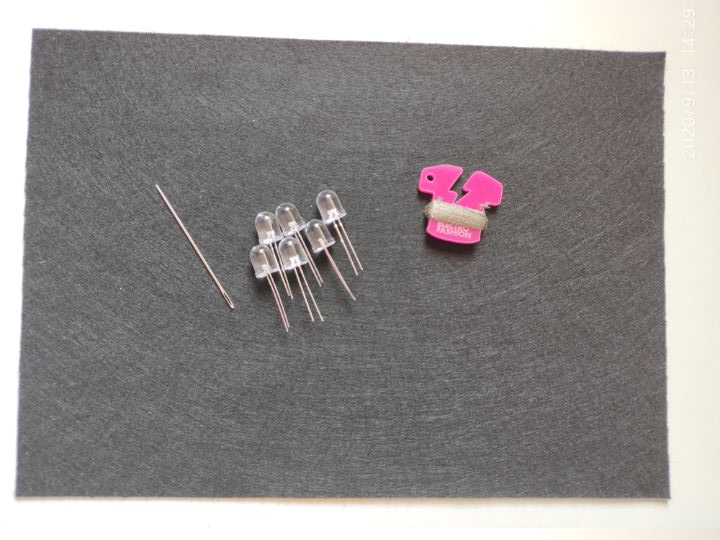
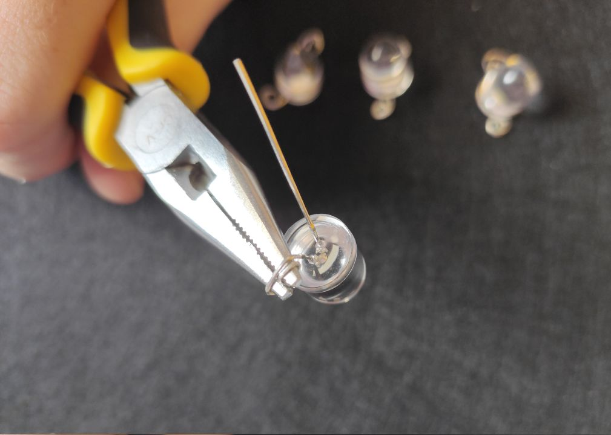
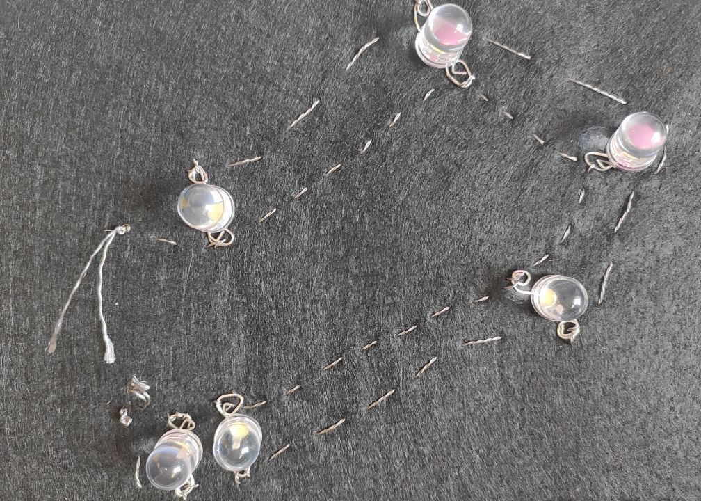
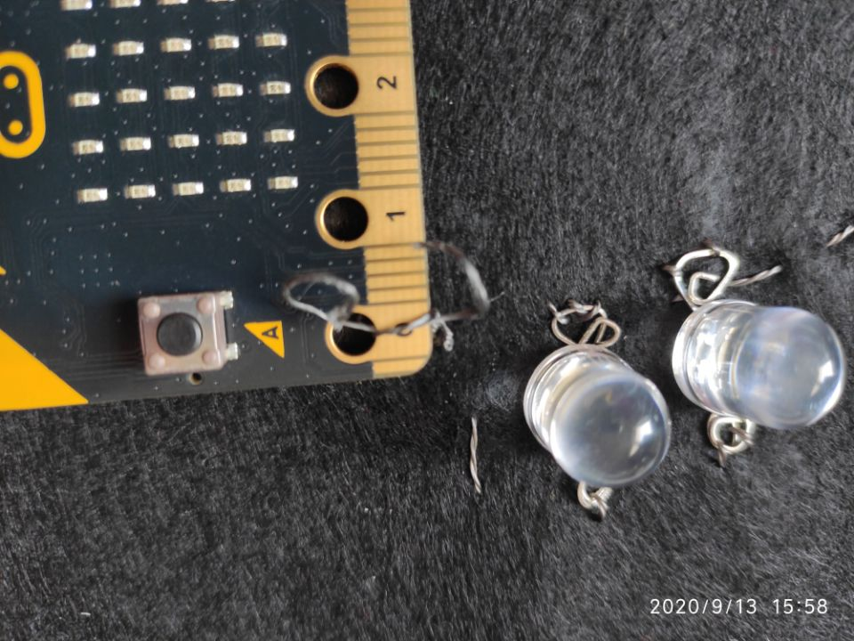
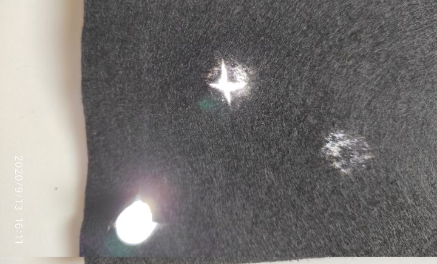

Title:   	Nočná obloha
Teacher:	True

# Nočná obloha
## 	Wearables (nositeľná elektronika)

// LEFT



// RIGHT

Ako často sa pozeráte na nočnú oblohu? Viete pomenovať súhvezdia? Poďme si skúsiť vytvoriť nočnú oblohu, ktorá bude svietiť aj v izbe, napríklad s pomocou micro:bitu a LED diód. Aké súhvezdie si vyberieme? Je to len na vás. V postupe si ukážeme súhvezdie Váhy.

**Čo budeme potrebovať:**

*   čierna (alebo tmavomodrá) plsť
*   BBC micro:bit
*   USB kábel
*   elektrovodivá niť
*   ihla
*   6 kusov LED diód (počet kusov závisí od počtu hviezd)
*   trblietavé lepidlo
*   kombinované kliešte
*   biela niť

// END

A4 plsť prestrihneme na polovicu, pretože budeme potrebovať vonkajšiu a vnútornú stranu. Najskôr pracujeme s vnútornou stranou. Po tom, ako sme si vybrali súhvezdie, si označíme jednotlivé “hviezdy”, teda umiestnenia LED diód. Môžeme si pri tom pomôcť vytlačením súhvezdia, vytlačený papier položíme na plsť a ihlou urobíme diery tam, kde chcem mať LED diódy.

### Zapájanie LED diód

// LEFT




Potrebujeme zapojiť viacero LED diód, ktoré budú pripojené k jednému micro:bitu na spoločný programovateľný pin. To dosiahneme prostredníctvom paralelného pripojenie, t.j. pod sebou. Najskôr si kombinovanými kliešťami upravíme nožičky na kruhovité útvary. Dajme pozor na to, aby sme rozpoznali katódy od anód. To docielime tak, že jeden typ nožičiek budeme ohýbať do kruhu silnejšie, čím vznikne menší kruh a druhý typ ohneme slabšie, aby bol kruh väčší. LED diódy naukladáme na vnútornú stranu tak, aby sme dokázali jedným predným ťahom zapojiť elektrovodivou niťou katódy a ďalším jedným ťahom anódy, pričom sa jednotlivé ťahy nebudú prekrývať, aby nedošlo k skratu. 

// RIGHT




Namiesto pripojenia krokosvoriek môžeme použiť iný typ zapojenia micro:bitu. Na ihlu si navlečieme niť. Niť si na jednej časti rozdelíme na polovicu (“rozšuchoríme” niť) a asi o 4 - 5 cm spravíme uzlík. Takto nám vyčnievajú 2 nite, ktorými si môžeme prichytiť micro:bit tak, že v dierke pinu spravíme uzlík. Potom predným ťahom prišívame jednotlivé LED diódy. Podobný postup opakujeme pri zemi, pine GND. Vytvoríme si časť nite, na ktorú pripevníme pin a šijeme zvyšné nožičky LED diód za sebou. Pokiaľ to bude potrebné, stačí rozopnúť niť a micro:bit môžeme vybrať.


// END

// NEWPAGE

### Programujeme

// LEFT

Najskôr si vyskúšajme, či LED diódy svietia. Vyberieme príkaz _digitálne zapísať kolík P0 hodnota 1_ z kategórie _kolíky_ a vložíme do cyklu _vždy_. Vidíme, že LED diódy svietia. Vieme to dosiahnuť aj bez programovania? Toto áno, namiesto pinu 0 stačí, ak by sme pripojili pin 3V, kde je stále napätie.

`ToDo: pridať MakeCode kód`

// RIGHT



// END

!!! primary "Prečo hviezdy blikajú?"

	Zamysleli ste sa nad tým, prečo hviezdy blikajú? Skúste vyjsť večer na vyššie miesto, napríklad kopec alebo rozhľadňu a všimnite si mesto. Nielen hviezdy, ale aj osvetlenie v meste bude blikať. Je to spôsobené pohybom vzduchu a putovaním svetla. Keďže sa vzduch pohybuje a má rôznu teplotu, putovanie svetla sa mihoce. Takýto jav sa nazýva scintilácia.

Poďme si scintiláciu simulovať na našej nočnej oblohe. Vieme, že niekedy sa nám zdá, že svetlo z hviezd blikne. To je ľahko vyriešiť blikaním LED diódy. Skúsme pridať príkaz _pozastaviť (ms) 100_. Oba príkazy následne skopírujeme a pri kolíku zmenímu hodnotu na 0. Takto nám LED dióda pravidelne bliká.

Blikajú hviezdy pravidelne? Určite nie. Môžeme povedať, že blikajú náhodne, teda určitý čas svietia a zrazu sa malú chvíľu zhasnú, opäť sa rozsvietia a znova svietia nejaký čas. Musíme si teda naprogramovať náhodný čas svietenia a následne rýchle bliknutie, čo môžeme nastaviť napr. na 200 ms.

// LEFT

Potrebujeme si zadefinovať premennú, teda názov miesta, s ktorým budeme pracovať. Pomenujme si ju čas a vytvoríme ju v kategórii _premenná_ .Následne vyberieme z kategórie _matematika_ príkaz _vybrať náhodne 0 do 10_. Ak chceme vybrať náhodný počet sekúnd od 1 sekundy do 10 sekúnd, musíme si ich previesť do milisekúnd.

1 sekunda = 1000 milisekúnd

10 sekúnd = 10 000 milisekúnd

Oba príkazy spojíme a vyjde nám _nastaviť čas na vybrať náhodne 1000 do 10000_. 

// RIGHT

```makecode
_PkLVdx5t2Dww
```

// END

Teraz nám vyberie náhodne od 1 do 10 sekúnd, ale potrebujeme to priradiť do času svietenia. Z kategórie _premenná_ vyberieme _čas_ a vložíme ju do pauzy svietenia namiesto čísel. Takto nám vždy vyberie náhodné číslo, ktoré bude svietiť, potom zhasne a znova vyberie náhodné číslo…

// NEWPAGE

### Vonkajšia strana

// LEFT



// RIGHT


// END

Zvyšná strana plste bude slúžiť ako vonkajšia. Vzájomne ich prekryjeme a tam, kde sa nachádzajú LED diódy, vystrihneme krížiky, aby sme mohli obe plste spojiť, čím budú LED diódy viditeľné. Keď vidíme umiestnenia LED-iek, obyčajnou bielou niťou spojíme na vonkajšej strane jednotlivé LED-ky, aby vytvárali želané súhvezdie. Potom spojíme obe plste a je na nás, či si nočnú oblohu vytvoríme do tvaru obrazu a zavesíme na stenu, alebo si ju prišijeme na oblečenie.
