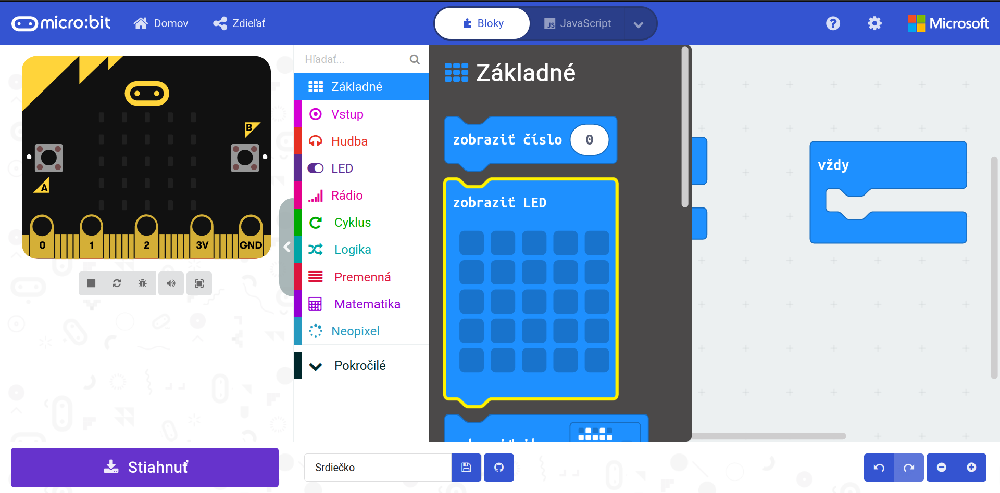
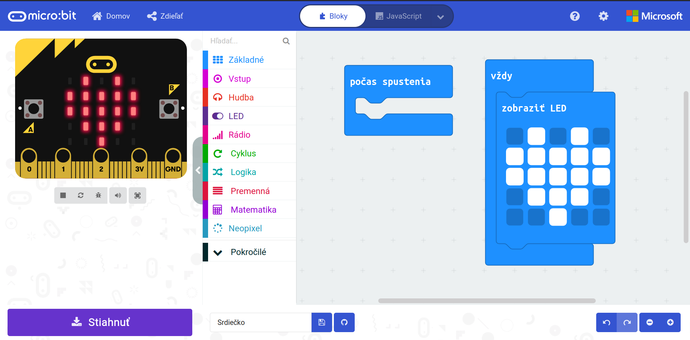
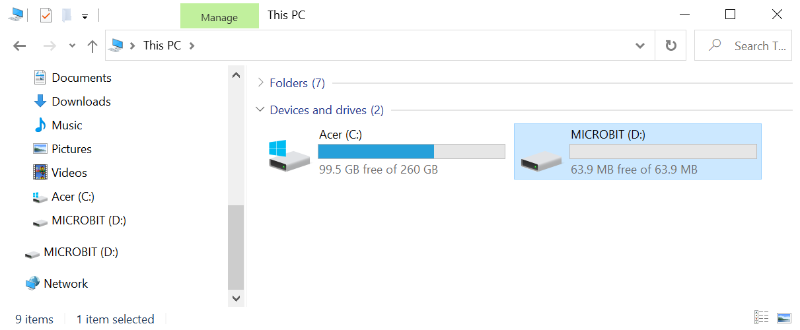
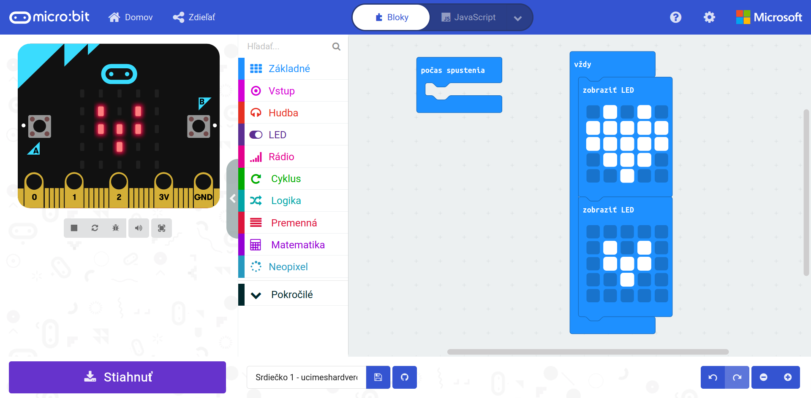

Title:   	Animácie

# Animácie
## micro:battle #1

// LEFT


// RIGHT

<div markdown="1" class="lection-desc">
Táto hodina je zameraná na animácie. Prejdeme si, z čoho sa skladá animácia a ako ich tvoriť na micro:bite.
</div>

**Potrebné pomôcky:** BBC micro:bit, USB kábel, počítač.  
Pracovať budeme v online prostredí [makecode.microbit.org](https://makecode.microbit.org/)


Pred aktivitami s micro:bitmi by si žiaci mali pozrieť video youtubera GoGa o [virtuálnej realite](https://www.youtube.com/watch?v=Eyr-geK-hPw).

// END

### 1. Otvorenie hodiny

Pred začatím aktivít s micro:bitmi sa žiakov spýtajte, čo nové sa dozvedeli vo videu o [virtuálnej realite](https://www.youtube.com/watch?v=Eyr-geK-hPw). Prejsť môžete témy:

* Čo je to animácia? *(Môžete si pomôcť rámčekom nižšie.)*
* Akú animáciu vo videu zobrazoval micro:bit? *(Animáciu srdiečka.)*
* Koľko pixelov má displej na micro:bite? *(5 krát 5 -- spolu 25 pixelov.)*
* Aký je rozdiel medzi virtuálnou a rozšírenou realitou? *(Môžete si pomôcť rámčekom na druhej strane tohto materiálu.)*


!!! info "Ako vzniká animácia?"
    Vytvoriť animáciu v zásade vôbec nie je náročné, stačí vytvoriť niekoľko obrázkov nejakej postavičky alebo objektu a každý z obrázkov iba mierne posunúť či poupraviť. Ak takýchto obrázkov spravíme dostatočne veľa a prehráme ich rýchlo za sebou ľudskému oku, splynú do spoločného obrazu -- animácie. Napríklad rýchlym prehrávaním šiestich obrázkov nižšie by sme získali animáciu skákajúcej loptičky.
    

### 2. Zobrazenie obrázku srdiečka na micro:bite

Žiakov naveďte na stránku [makecode.microbit.org](https://makecode.microbit.org/), kde je potrebné vytvoriť *Nový projekt* a ľubovoľne si ho menovať. V prípade, že sa prostredie otvorí v anglickom jazyku, je možné zmeniť jazyk kliknutím na ozubené koliesko hore vpravo a v sekcii *Language* zvoliť *Slovenčinu*. Odporúčame prvý krát postup ukazovať žiakom na projektore.

// LEFT



// RIGHT

V prostredí MakeCode máme 3 hlavné časti:

* vpravo je miesto na tvorbu programu;
* v strede je knižnica príkazov, ktoré môžeme použiť;
* na ľavej strane je simulátor.

Keďže chceme zobraziť srdiečko, žiakom predstavte príkaz z kategórie `Základné` s názvom `zobraziť LED`. Ten je potrebné vložiť do bloku `vždy` a vyklikať na ňom srdiečko. Následne by sa automaticky malo strdiečko zobraziť v ľavej časti prostredia -- na micro:bit simulátore (niekedy je potrebné *reštartovať simulátor* pomocou tlačidiel pod simulátorom).


// END


// NEWPAGE

// LEFT

Aby sa srdiečko zobrazilo aj na micro:bitoch, ktoré držia žiaci v rukách, je potrebné micro:bit pripojiť pomocou klasického micro USB kábla k počítaču (taký istý sa používa aj na nabíjanie väčšiny Android mobilov). V počítači sa po pripojení micro:bit zobrazí ako USB úložisko s názvom *MICROBIT* -- na toto úložisko budú žiaci nahrávať svoj program.

Už máme všetko pripravené -- aj program v prostredí MakeCode, aj micro:bit pripojený pomocou USB kábla -- zostáva iba nahrať vytvorený program na micro:bit. Súbor s programom si žiaci stiahnu do počítača pomocou tlačidla *Stiahnuť* dolu vľavo. Do počítača sa im následne stiahne súbor so špeciálnou prípomou *.hex* -- upozornite žiakov, aby **tento súbor nijako neotvárali ani nespúšťali na počítači**. Jediné, čo stačí  spraviť, je skopírovať stiahnutý súbor s príponou *.hex* na úložisko *MICROBIT* -- ako keby sme kopírovali fotku z počítača na USBčko. Počas kopírovania sa rozbliká malá žltá indikačná LEDka na zadnej strane micro:bitu, a po doblikaní by na displeji už malo svietiť srdiečko.

// RIGHT






// END


// LEFT

### 3. Animácia srdiečka

V tejto aktivite si žiaci naprogramujú animáciu bijúceho srdiečka. Opäť na to využijú príkaz `zobraziť LED` z kategórie `Základné`, ktorý tiež vložia do bloku `vždy`. Na ňom je potrebné "vyklikať" zmenšené srdiečko (tak, ako je na ukážke kódu vedľa).

Ihneď po dokončení "vyklikávania" menšieho srdiečka by sa animácia mala zobraziť na simulátore v ľavej časti prostredia. Aby sa animácia žiakom zobrazovala aj na micro:bite, opäť je potrebné *Stiahnuť* nový súbor s príponou *.hex* a tento nový súbor nahrať na úložisko *MICROBIT*.

Pri opakovaných stiahnutiach nových programov z prostredia MakeCode sa môže stať, že niektorí žiaci budú omylom nahrávať na micro:bit niektorý zo starších stiahnutých programov. **Uistite sa, že žiaci vždy nahrávanú najnovší stiahnutý program na micro:bit.**


// RIGHT





// END

!!! info "Virtuálna realita vs. rozšírená realita"
    **Virtuálna realita** (skratka **_VR_**) využíva technológie na vytvorenie plne simulovaného sveta -- vo videu to bol simulátor *horskej dráhy* a *pádu z vysokej budovy*. Užívateľ sa väčšinou dokáže vo virtuálnom prostredí pohybovať. Vďaka tomu, že virtuálna realita plne simulovaná, môže byť zasadená v akomkoľvek prostredí -- či už je to simulovanie horskej dráhy, vysokej budovy alebo úplne inej planéty. Na virtuálnu realitu sa väčšinou používavajú špeciálne okuliare so slúchadlami (anglicky *VR headset*).

    **Rozšírená realita** (anglicky *Augmented reality*, skratka **_AR_**) je na rozdiel od virtuálnej reality zasadená v skutočnom svete, ktorý iba obohacuje. Na rozdiel of *VR* nie je na rozšírenú realitu potrebný špeciálny hardvér, *AR* aplikácie môžu byť spustené aj na bežných smarfónoch či tabletoch. Vo videu to bolo vidieť na aplikácii pre študentov medicíny, pomocou ktorej na reálnej stoličke "stálo" ľudské telo. Žiaci tiež možno budú poznať populárnu *AR* videohru *Pokémon GO*, ktorá pomocou kamery telefónu a GPS súradníc prepájala herné prostredie s reálnym svetom. 

// NEWPAGE

// LEFT

### 4. Animácia snežného anjela

Pred tvorbou ďalšej animácie majú žiaci dve možnosti -- buď vymazať program k predchádzajúcej aktivite (čo by bolo samozrejme škoda) alebo vytvoriť si nový program kliknutím na tlačidlo *Domov* (hore vľavo). To žiakov presmeruje na úvodnú stránku prostredia, kde je možné vytvoriť a pomenovať si nový projekt. Na tejto úvodnej stránke sa nachádzajú aj všetky uložené projekty, ktoré boli vytvorené v danom prehliadači.

Ďalšiu animáciu, ktorú si žiaci vytvoria, je pohybujúca sa postavička, ktorá leží v snehu a kreslí doň "snežného anjela". To znamená, že postavička hýbe rukami aj nohami. Dopredu žiakom ukážte hotovú animáciu pomocou simulátora (neukazujte im zdrojový kód). Následne si animáciu so žiakmi rozdeľte na 4 časti:

**1. časť** -- panáčik má vystreté nohy a ruky vystreté vedľa seba  
**2. časť** -- panáčik urobí rukami oblúk hore  
**3. časť** -- panáčik posunie nohy smerom do strán  
**4. časť** -- panáčik posunie roku naspäť k sebe  

Ak túto animáciu dáme do bloku `vždy`, animácia sa bude opakovať.

Pre zobrazenie ukážky animácie v simulátore si môžete kliknúť na odkaz dolu pod kódom vedľa a zvoliť možnosť *Simulátor*.

### 5. Záverečná diskusia

So žiakmi môžete diskutovať, v čom sa micro:bit displej odlišuje od displeju na mobile či v smart hodinkách:

- Micro:bit má iba 5x5 pixelov, obrazovky na počítačoch či mobiloch majú stovky až tísícky pixelov.
- Micro:bit má iba jednofarebné LEDky (pixely), bežné obrazovky vedia zobrzaziť akúkoľvek farbu.
- Pixely na micro:bite sú dosť "veľké" -- na približne 9 cm<sup>2</sup> sa zmestí iba 25 pixelov, bežné obrazovky na mobilných telefónoch pritom bežne na 1 cm<sup>2</sup> zmestia približne 160 pixelov, obrazovky s vysokým rozlíšením aj oveľa viac. 

Displej micro:bitu je síce veľmi jednoduchý, no aj takéto jednoduché displeje majú svoje využitie -- napríklad mnoho autobusov využíva jednofarebné LED displeje na zobrazovanie čísla autobusu. Zároveň, skúsenosti z programovania animácií na micro:bite môžu niektorých žiakov motivovať k tvorbe "náročnejších" animácií.


// RIGHT

```makecode
_3efL73cTo70T
```

// END

!!! info "Aktivity navyše"
    - Žiaci majú pomocou internetu zistiť, aké rozlíšenie (koľko pixelov celkovo a koľko pixelov na cm<sup>2</sup>) má ich mobilný telefón.
    - Žiaci môžu vytiahnuť svoje mobilné telefóny, tablety alebo inteligentné hodinky a skúsiť popísať, aké animácie na nich nájdu (napr. animácia zobrazenia notifikácie, otvorenie aplikácie, atď.)
    - Žiaci majú pomocou internetu nájsť čo najviac možných konkrétnych využítí pre *VR* a *AR* -- napr. vo vzdelávaní, priemysle, zdravotníctve, atď.
