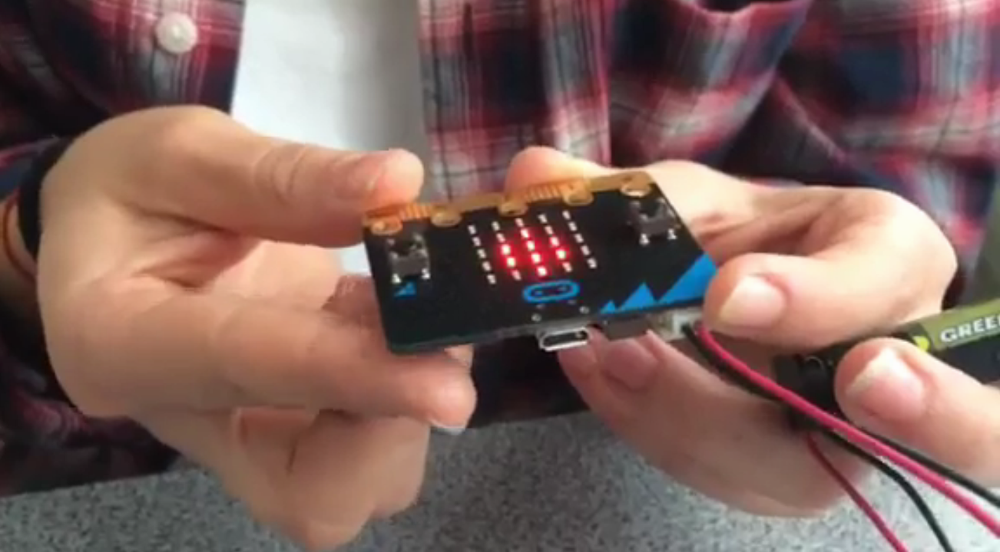

Title:   	Akcelerometer

# Akcelerometer
## micro:battle #3

// LEFT



// RIGHT

<div markdown="1" class="lection-desc">
Táto hodina je zameraná na prácu so zabudovaným senzorom pohybu -- akcelerometrom.
</div>

**Potrebné pomôcky:** BBC micro:bit, USB kábel, lepiaca páska, batéria k micro:bitu a počítač.  
Pracovať budeme v online prostredí [makecode.microbit.org](https://makecode.microbit.org/)

Pred aktivitami s micro:bitmi by si žiaci a žiačky mali pozrieť video youtubera GoGa s [Petrom Saganom](https://www.youtube.com/watch?v=cuDRBUVd0C4) (ako prípravu na hodinu).


// END

### 1. Otvorenie hodiny

Pred začatím aktivít s micro:bitmi sa žiakov a žiačok spýtajte, čo nové sa dozvedeli vo videu s [Petrom Saganom](https://www.youtube.com/watch?v=cuDRBUVd0C4). Prejsť môžete témy:

* Aké technológie prenikajú do cyklistiky? *(Napr. merače tepu, merače otáčok a wattmetre.)*
* Myslí si Peťo Sagan, že raz cyklistov nahradia roboty? *(Nie.)*
* Pomocou akého senzoru micro:bit vo videu meral počet otáčok GoGa a Peťa? *(Akcelerometrom.)*
* Čo je to akcelerometer? A kde sa využíva? *(Môžete si pomôcť rámčekom nižšie.)*


!!! info "Čo je to akcelerometer?"
    Akcelerometer je senzor, ktorý meria akceleráciu (po slovensky zrýchlenie). Je celkom rozšírený -- nájdete ho v autách, mobiloch aj krokomeroch. Častokrát býva skombinovaný aj s ďalším senzorom -- gyroskopom, senzorom naklonenia. Ten meria, ktorým smerom a ako veľmi je micro:bit naklonený. Keďže tieto dva senzory (akcelerometer a gyroskop) sú väčšinou skombinované do jednej súčiastky (nachádza sa na zadnej strane micro:bitu), tak ich pre zjednodušenie budeme obe nazývať spoločne "akcelerometer".

!!! info "Kde sa využíva akcelerometer?"
    - Mobilný telefón/tablet využíva senzor naklonenia na otáčanie obrazovky.
    - Airbagy v autách využívajú merač zrýchlenia na zistenie nárazu, kedy auto prudko spomalí (čiže opak zrýchlenia – spomalenie).
    - Krokomer (aj ten v mobiloch či smart hodinkách) využíva akcelerometer na rozpoznanie počtu krokov.


// LEFT

### 2. Krokomer

Pomocou micro:bitu sa relatívne jednoducho dá vytvoriť krokomer -- micro:bit s baterkou si žiaci a žiačky môžu pripevniť k topánke a počítať, koľkokrát sa micro:bitom "potrasie". Každé potrasenie micro:bit vyhodnotí ako krok. To, koľko krokov spravia, si micro:bit zapamätá do premennej. Detailný postup, ako si z micro:bitu vytvoriť krokomer, nájdete v digitálnej databáze enter.study -- [lekcia "KROKOMER"](https://enter.study/navod/krokomer-kolko-krokov-denne-spravis/).

// RIGHT


// END

### 3. Otáčanie micro:bitom "ako na mobile"

// LEFT

Micro:bitom je možné snímať, do ktorej strany je naklonený a podľa toho otáčať smajlíka na displeji -- aby nikdy nebol "dole hlavou". Aby si to žiaci a žiačky vedeli lepšie priblížiť, pokojne im povoľte vytiahnuť "smartfóny" a otáčať nimi -- obrazovka by sa mala vždy otočiť do tej strany, do ktorej je otočený micro:bit.


Na snímanie naklonenia je potrebné použiť príkaz `keď potrasenie` z kategórie *"Vstup"*. Keď žiaci a žiačky kliknú na slovo "potrasenie", zobrazí sa im viacero polôh, ktoré dokáže micro:bit zosnímať. Na tvorbu otáčajúceho sa smajlíka budú potrebovať polohy *"naklonenie vľavo"*, *"naklonenie vpravo"*, *"logo hore"* a *"logo dole"*. Do nich pomocou príkazu `zobraziť LED` z kategórie *"Základné"* následne nakreslia štyroch smajlíkov tak, aby sa pri otáčaní micro:bitom otáčal aj smajlík -- viď program vpravo.

Program je možné ešte pred nahratím na micro:bit odskúšať aj v simulátore -- micro:bit v ňom síce nevieme otočiť, no vieme ho "nakloniť" prechádzaním myškou po jeho okrajoch. Pri prechádzaní myškou po štyroch stranách micro:bitu by sa mal obrázok na displeji otáčať.

Ďalšie jednoduché aktivity s akcelerometrom a gyroskopom -- *digitálnu kocku*, *náhodný generátor čísel* a *digitálnu mincu* -- nájdete v lekcii ["SENZOR POHYBU (AKCELEROMETER)"](https://enter.study/navod/senzor-pohybu-akcelerometer/).

// RIGHT

```makecode-no-link
_4iCEzJa90P26
```
```makecode-no-link
_RrCCpMcJ4654
```
```makecode-link-only
_3XuPAaH80F3K
```

// END

### 4. Záverečná diskusia

V rámci záverečnej diskusie môžete nechať žiakov a žiačky porozmýšľať, či si spomenú aj na ďalšie zariadenia, ktoré majú v sebe akcelerometer alebo gyroskop (okrem tých, ktoré spomenuli už na začiatku hodiny). Prípadne môžete viesť diskusiu k lekcii ["KROKOMER"](https://enter.study/navod/krokomer-kolko-krokov-denne-spravis/) ohľadom odporúčaní, koľko krokov je vhodné denne spraviť.


!!! info "Aktivity navyše"
    - Žiaci a žiačky majú pomocou internetu nájsť ďalšie možné využitia akcelerometra a gyroskopu.
    - Žiaci a žiačky majú pomocou internetu nájsť mobilné bežecké aplikácie, ktoré pomocou senzora pohybu na mobile merajú aj počet krokov.
