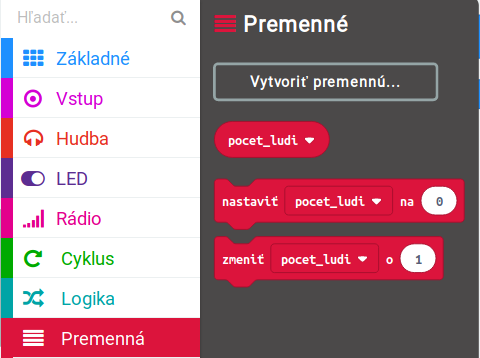
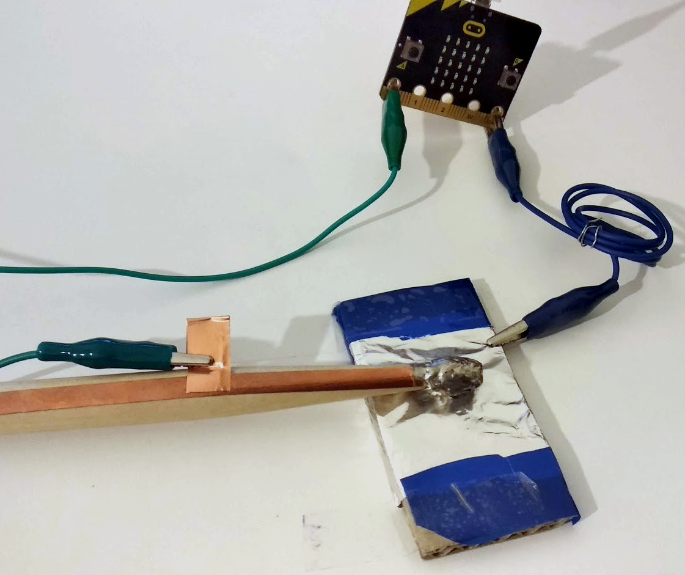

Title:   	Počítadlá

# Počítadlá
## micro:battle #4

// LEFT



// RIGHT

<div markdown="1" class="lection-desc">
Táto hodina je zameraná na tvorbu "počítadiel" -- programov, ktoré si pomocou premenných ukladajú číselné hodnoty. 
</div>

**Potrebné pomôcky:** BBC micro:bit, USB kábel a počítač.  
Pracovať budeme v online prostredí [makecode.microbit.org](https://makecode.microbit.org/)


Pred aktivitami s micro:bitmi by si žiaci a žiačky mali pozrieť video youtubera GoGa s [bubeníčkou Nikoletou Šurinovou](XXX) (ako prípravu na hodinu).

// END

### 1. Otvorenie hodiny

Pred začatím aktivít s micro:bitmi sa žiakov a žiačok spýtajte, čo nové sa dozvedeli vo videu s [bubeníčkou Nikoletou Šurinovou](XXX). Prejsť môžete témy:

* Ako micro:bit vo videu snímal počet úderov? *(Pomocou snímania uzatvorenia elektrického obvodu -- na bubon aj na paličky bola preto pripevnená vodivá páska a z oboch viedli kábliky k micro:bitu.)*
* Kde sa zobrazoval počet úderov, ktoré snímal micro:bit? *(Na počítači v prostredí Microsoft MakeCode.)*
* Ako sa prenášala informácia o počte úderov z micro:bitu do počítača? *(Sériovou komunikáciou cez USB kábel medzi micro:bitom a počítačom.)*


// LEFT

### 2. Princíp "počítadla"

Príkladmi "počítadiel" v reálnom živote môžu byť:

- Inteligentné križovatky, ktoré pomocou kamier na stĺpoch alebo magnetických senzorov zabudovaných v asfalte zaznamenávajú počet áut a zapamätávajú si, z ktorej strany a kedy prišli. Na základe toho môžu správcovia križovatiek lepšie nastaviť semafory, aby cez ne čo najrýchlejšie prešlo čo najviac áut.
- Počítadlá áut na parkoviskách -- možno si žiaci a žiačky už niekedy všimli, že niektoré parkoviská majú pri vchode displej s číslom aktuálne voľných parkovacích miest.

// RIGHT

)](images/senzor.JPG)


// END

!!! info "Čo je to premenná?"
    Počítadlo si pamätá nejaké číslo, ktoré sa postupne mení (napr. vo videu sa zvyšoval počet úderov). Micro:bit si tieto čísla pamätá pomocou *premennej*. *Premennú* je možné predstaviť si ako krabičku, do ktorej si uložíme nejaké číslo, a ak potrebujeme, môžeme toto číslo kedykoľvek zvýšiť alebo znížiť.

    Micro:bit si do *premenných* nemusí ukladať iba čísla, ale môžeme tam uložiť napríklad aj text, obrázky či nejaké zložitejšie údaje. Na tejto hodine budú žiaci a žiačky do premenných ukladať iba čísla.

// NEWPAGE

### 3. Počítadlo ľudí

// LEFT

S premennými sa žiaci a žiačky mohli stretnúť už pri predchádzajúcej hodine pri aktivite "Krokomer". V dnešnej aktivite si vytvoria užitočnú pomôcku -- počítadlo ľudí. Tie sa využívajú napríklad na festivaloch, verejných podujatiach či diskotékach, aby organizátori vedeli, koľko ľudí pustili dnu. V súčastnosti ich často používajú obchody, aby v súlade s protipandemickými nariadeniami limitovali počet zákazníkov vo vnútri obchodu.

Detailný návod, ako zostrojiť počítadlo, nájdete v lekcii ["Objavujeme premenné – počítadlo ľudí"](https://enter.study/navod/objavujeme-premenne-pocitadlo-ludi/). Nájdete v ňom postup, ako pracovať s premennými v prostredí MakeCode, ako aj informácie ohľadom toho, kam si micro:bit ukladá údaje. Výsledný program sa nachádza vpravo.

// RIGHT

```makecode
_bWD7MDg3AeXU
```

// END

### 4. Počítanie úderov na bubne

// LEFT

Ako snímal micro:bit počet úderov paličkami vo videu? Pomocou snímania uzatvorenia elektrického obvodu -- na bubon aj na paličky bola preto pripevnená vodivá páska a z oboch viedli kábliky k micro:bitu. Kým paličky boli pripojené ku kolíku "P0", vodivá páska na bubne bola pripojená ku kolíku "GND". Viac podrobností o uzatváraní elektrických obvodov a o kolíkoch (anglicky *pinoch*) na micro:bite žiaci a žiačky zistia na nasledujúcej hodine s názvom "Vstupné piny".

Ak by ste sa v budúcnosti (pri prechádzaní hodiny "Vstupné piny") rozhodli so žiakmi spraviť túto aktivitu, namiesto bubna môžete využiť aj kúsok kartónu, na ktorý sa prilepí obojstrannou lepiacou páskou alobal (prípadne môžete použiť vodivú medenú pásku, ktorá je pevnejšia ako alobal). Alobal (prípadne pásku) potom žiaci a žiačky prilepia aj na bubenícke paličky. Jednotlivé vodivé časti stačí potom už len pripojiť k micro:bitu.

// RIGHT



// END

### 5. Záverečná diskusia

V rámci záverečnej diskusie môžete nechať žiakov a žiačky porozmýšľať, či si spomenú aj na ďalšie zariadenia, ktoré fungujú ako "počítadlá". Spýtajte sa žiakov, ako by počítadlo využili oni.

V diskusii si môžete pomôcť aj otázkami z lekcie ["Objavujeme premenné – počítadlo ľudí"](https://enter.study/navod/objavujeme-premenne-pocitadlo-ludi/):

*   Aký je rozdiel medzi RAM a FLASH pamäťou?
*   Ukladajú sa premenné do RAM pamäte alebo do FLASH pamäte?
*   Ako vytvorím novú premennú v prostredí MakeCode?