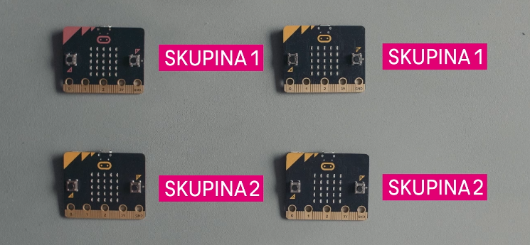

Title:   	Rádio

# Rádio
## micro:battle #7

// LEFT



// RIGHT

<div markdown="1" class="lection-desc">
Táto hodina je zameraná na bezdrôtovú komunikáciu s micro:bitmi.
</div>

**Potrebné pomôcky:** 2x BBC micro:bit.  
Pracovať budeme v online prostredí [makecode.microbit.org](https://makecode.microbit.org/)


Pred aktivitami s micro:bitmi by si žiaci a žiačky mali pozrieť video youtubera GoGa s [Michaelou Dorčíkovou](https://www.youtube.com/watch?v=VLhWF5yXNAI) (ako prípravu na vyučovanie).

// END

### 1. Otvorenie hodiny

Pred začatím aktivít s micro:bitmi sa žiakov a žiačok spýtajte, čo nové sa dozvedeli vo videu s [Michaelou Dorčíkovou](https://www.youtube.com/watch?v=VLhWF5yXNAI). Prejsť môžete témy:

* Aký je rozdiel v technológiách medzi F1 a NASCAR? *(Kým autá v NASCAR majú iba málo technológií a pretekári sa spoliehajú predovšetkým na svoje zručnosti, monopost F1 je plný elektroniky, ktorá vo veľkej miere pretekárom pomáha.)*
* Čo je to "telemetria"? *(Telemetria je meranie údajov na diaľku, napr. výkon a teplotu motora, spotrebu, tlak v kolesách, šmyk či rýchlosť. Na pretekoch F1 má každý tím svojho inžiniera, ktorý tieto údaje analyzuje a na ich základe radí pretekárovi.)*

### 2. Rádiová komunikácia s micro:bitmi


Micro:bit dokáže bezdrôtovo komunikovať vďaka malej anténe umiestnenej na zadnej strane zariadenia (vľavo hore). Nachádza sa vo verzii jeden aj dva micro:bitu, no pri druhej verzii je trochu výraznejšia. Rádiová komunikácia však na oboch verziách funguje rovnako, čiže ak máte dva micro:bity rozdielnych verzií, nemusíte sa obávať -- budú vedieť navzájom komunikovať.


!!! info ""

	Aby dva micro:bity vedeli navzájom komunikovať, musia mať v prostredí MakeCode nastavenú rovnakú rádio skupinu. Princíp je rovnaký, ako pri klasických ručných vysielačkách -- ak sa chcú dvaja ľudia cez vysielačky počuť, musia mať pred vysielaním nastavený rovnaký kanál.


### 3. Posielanie smajlíkov

V tejto aktivite odporúčame žiačky a žiakov rozdeliť do dvojíc. V rámci dvojice budú programovať dva micro:bity -- prvý bude slúžiť ako diaľkový ovládač a vysielať bezdrôtové správy, aký smajlík sa má na displeji micro:bitu zobrazovať. Druhý bude tieto správy prijímať a podľa toho zobrazovať buď šťastného, alebo smutného smajlíka.

// LEFT

#### Vysielač

```makecode
_XoRabmHcb3F8
```

// RIGHT

V prostredí MakeCode sa nachádzajú príkazy na bezdrôtovú komunikáciu v kategórii "Rádio". Úplne prvý príkaz v tejto kategórii, "rádio nastaviť skupinu", je potrebné umiestniť do bloku "počas spustenia".

Keďže chceme druhý micro:bit ovládať stláčaním tlačidiel, z "Vstup" vezmem príkaz "keď sa tlačidlo A stlačí". Doň potrebujem umiestniť príkaz na odoslanie smajlíka -- taký, však, neexistuje. Preto namiesto smajlíkov budeme posielať čísla pomocou príkazu "rádio odoslať číslo". Ak chceme zobraziť šťastného smajlíka, pri stlačení tlačidla A odošleme číslo 1. A ak chceme zobraziť smutného smajlíka, pri stlačení tlačidla B odošleme číslo 2.

Výsledný program je potrebné nahrať do prvého micro:bitu (program sa nachádza vľavo).

// END


#### Prijímač

// LEFT


```makecode-no-link
_b5D55DEuuLip
```

```makecode-no-link
_ebAF8q02KX7y
```

```makecode-link-only
_KJaDDkP9Thzd
```

// RIGHT

V programe pre druhý micro:bit je opäť potrebné nastaviť skupinu s rovnakým číslom ako na prvom micro:bite príkazom "rádio nastaviť skupinu".

Micro:bit vie správy z prvého micro:bitu prijímať pomocou príkazu "rádio pri prijatí čísla receivedNumber". Vždy, keď micro:bit dostane nejaké číslo cez bezdrôtovú správu, uloží ju do  premennej "receivedNumber". Táto premenná sa vytvára automaticky pri použití spomenutého príkazu. Keďže chceme na základe prijatej správy zobrazovať buď šťastného, alebo smutného smajlíka, musíme pomocou podmienky z kategórie "Logika" porovnať, či je prijaté číslo jednotka alebo dvojka. Ak je to jednotka, micro:bit zobrazí šťastného smajlíka. A ak dvojka, micro:bit zobrazí smutného smajlíka.

Výsledný program je potrebné nahrať do druhého micro:bitu (program sa nachádza vľavo).


// END


Po naprogramovaní oboch micro:bitov by už žiaci a žiačky mali vedieť ovládať smajlíka na druhom micro:bite stláčaním tlačidiel na tom prvom. V tejto fáze ich môžete nechať experimentovať -- čo sa stane, ak si všetci nastavia rovnakú skupinu? A čo ak si niekoľko dvojíc nastaví jednu skupinu a zvyšné dvojice inú?


Prostredie MakeCode ponúka špeciálny mód, v ktorom je možné mať otvorené dva rôzne programy vedľa seba -- toto je obzvlášť vhodné pri tvorbe programov, ktoré využívajú bezdrôtovú komunikaciu. Do módu sa dostanete cez link: [https://makecode.microbit.org/--multi#](https://makecode.microbit.org/--multi#)

### 4. Ovládanie cudzieho micro:bitu

Keďže diaľkové ovládanie majú žiaci a žiačky z predchádzajúcej aktivity naprogramované aj odskúšané, môžete s nimi otvoriť tému informačnej spoločnosti -- "Bezpečnosť a riziká". Spoločne sa zamyslite:

* Čo je potrebné spraviť, aby som inej dvojici vedel "odchytávať" bezdrôtovú komunikáciu a zistiť, akého smajlíka nastavili?
* Čo je potrebné spraviť, aby som inej dvojici ovládal zobrazovanie smajlíka na ich micro:bite?

Odpoveď na obe otázky je veľmi jednoduchá -- postačuje nastaviť rovnakú rádiovú skupinu. Čo ak by sme ale potrebovali zvýšiť bezpečnosť bezdrôtovej komunikácie, aby nik správy neodchytával a ani ich nevedel poslať za nás? Na to je potrebné komunikáciu šifrovať nejakým kľúčom. Jedným zo spôsobov, ako zašifrovať komunikáciu medzi micro:bitmi, je použiť  
[Cézarovu šifru](https://sk.wikipedia.org/wiki/C%C3%A9zarova_%C5%A1ifra), v ktorej sa každé písmeno abecedy "posunie" o niekoľko pozícií ďalej.


### 5. Záverečná diskusia

So žiakmi a žiačkami môžete diskutovať, kde všade sa v každodennom živote využíva bezdrôtová komunikácia.

!!! info "Aktivity navyše"
	- Pri surfovaní na internete sa tiež stretávame s nešifrovanou komunikáciou (upozorní nás na to prehliadač, zvyčajne prekríženým zámkom na hornom paneli). V tom prípade je odchytávanie a posielanie falošných správ podobne jednoduché, ako v aktivite s micro:bitmi. Skúste uviesť pár situácií, kedy komunikácia s nezabezpečenými stránkami vie byť veľmi nebezpečná. *(Napr. keď niekam vkladáme citlivé údaje, keď sa prihlasujeme do internet bankingu, a pod.)*
	- Väčšina webových stránok dnes už komunikuje cez šifrovanú komunikáciu (napr. Google či Facebook), ale stále je možné nájsť aj také, ktoré komunikujú bez šifrovania. Skúste niekoľko takých nájsť. Taktiež skontrolujte aj webovú stránku vašej školy. *(Príkladom takej stránky je napr. [neverssl.com](http://neverssl.com/))*
