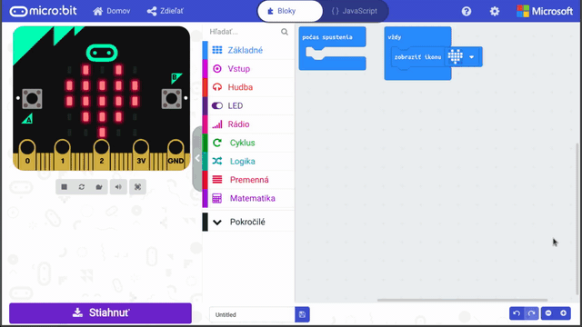

Title:	WebUSB

Ak máš moderný internetový prehliadač, môžeš nahrávať svoje programy rovno na BBC micro:bit z MakeCode alebo online
Python editora bez nutnosti sťahovať program na počítač a následne kopírovať HEX súbor na micro:bit.

Nahrávanie programov cez WebUSB šetrí čas a umožňuje jednoduchšie nahrávanie programov z prehliadača na micro:bit.

WebUSB vytvorí sériové spojenie medzi prehliadačom a micro:bitom cez USB kábel.

## Požiadavky

* Operačný systém: Windows 8+, Mac alebo Linux.
* Prehliadač Google **Chrome verzia 65 alebo vyššia** (iné prehliadače ešte nepodporujú WebUSB).
* **Firmvér verzia 0243 alebo vyššia** na micro:bite (návod na upgrade firmvéru nájdeš v ďalšej kapitole).

## MakeCode

    
1. Pripoj svoj micro:bit k počítaču pomocou micro USB kábla.
2. V [MakeCode editore](https://makecode.microbit.org/) klikni na tlačidlo *nastavenia* (ozubené koliesko hore vpravo)
a vyber možnosť *Pair Device*.
3. Ak sa ti zobrazí informačné okno o WebUSB, klikni na zelené tlačidlo *Pair device*.
4. Hore vľavo vyber zariadenie pomenované *BBC micro:bit CMSIS-DAP* a klini na *Connect*.
Mala by sa zobraziť informácia o úspešnom pripojení.
5. Vyskúšaj stihnuť svoj program priamo z prehliadača na micro:bit stlačením tlačidla *Stiahnuť*.

## Python

1. Pripoj svoj micro:bit k počítaču pomocou micro USB kábla.
2. V [MicroPython editore](https://python.microbit.org/) klikni na tlačidlo *Connect* (hore vľavo).
3. Hore vľavo vyber zariadenie pomenované *BBC micro:bit CMSIS-DAP* a klini na *Connect*.
4. Po pripojení sa k micro:bitu by sa mali zmeniť prvé dve tlačidlá v menu na *Flash* a *Disconnect*.
5. Vyskúšaj stiahnuť svoj program priamo z prehliadača na micro:bit stlačením tlačidla *Flash*.

Ak ti ani po všetkých krokoch vyššie WebUSB nefunguje, skús pozrieť stránku
[problémy s WebUSB na microbit.org](https://support.microbit.org/support/solutions/articles/19000105428-webusb-troubleshooting).
