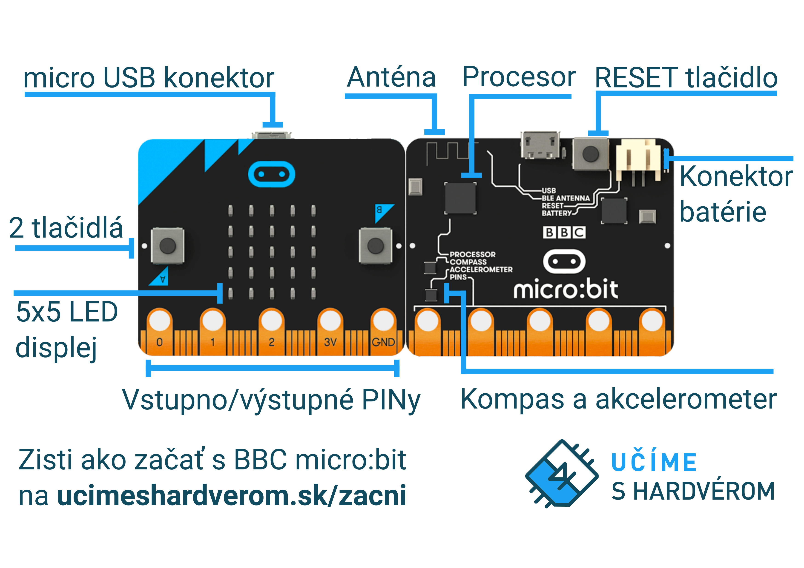

BBC micro:bit je programovateľný minipočítač, ktorý dodáva programovaniu "hmatateľnosť". Stačí vytvoriť jednoduchý
program a nahrať no pomocou USB kábla. Má niekoľko vbudovaných senzorov, napríklad kompas alebo akcelerometer, no vieme
k nemu pomocou vstupno/výstupných pinov pripojiť takmer akúkoľvek elektroniku - LED pásiky, motorčeky, senzor tepu, ...

<iframe width="560" height="315" src="https://www.youtube.com/embed/gHa1Knk4V4Y" frameborder="0" allow="accelerometer; autoplay; encrypted-media; gyroscope; picture-in-picture" allowfullscreen></iframe>

## Vbudované senzory
**Predná strana**  

* **2 tlačidlá** - micro:bit má 2 tlačidlá na prednej strane, ktoré môžeš naprogramovať aby spúšťal nejakú časť kódu :-)
                 tlačidlá sú označené tlačidlami  `A` a `B`
* **5x5 LED displej** - 25 červených LED diód vieš využiť na zobrazovanie obrázkov, textu a čísel. Zároveň ale slúžia
                      ako senzor - môžeš nimi merať intenzitu svetla, ktoré dopadá na micro:bit

**Zadná strana**  

* **Anténa** - micro:bit vie komunikovať 2 spôsobmi - buď s ďalšími micro:bitmi pomocou rádiovej komunikácie, alebo
             s inými zariadeniami pomocou Bluetooth. Klasické rádio si na ňom ale nenaladíš :-(
* **Procesor** - mozgom celého microbitu je procesor, ktorý vykonáva kód, ktorý naň nahráme. Obsahuje aj vbudovaný
               teplomer, ktorý ale nemeria teplotu prostredia, ale teplotu procesoru
* **RESET tlačidlo** - toto tlačidlo reštartuje micro:bit a spustí nahratý program od začiatku
* **micro USB konektor** - slúži na nahrávanie programov do micro:bitu a aj na napájanie, aby sme nemuseli míňať
                         batérie
* **Jedna žltá LED dióda** - indikuje, že micro:bit je pripojený k počítaču cez USB kábel, a pri nahrávaní programu
                           bliká
* **Konektor batérie** - namiesto USB kábla môžeme na napájanie micro:bitu použiť aj dve AAA batérie, ktoré pripojíme
                         k micro:bitu pomocou špeciálneho konektoru - tým pádom môžeš svoj micro:bit zobrať von z domu
* **Kompas** - magnetický senzor meria silu magnetického poľa a okrem svetových strán ním dokážeš určiť, či je v 
             blízkosti magnet
* **Akcelerometer** - sníma naklonenie a pohyby micro:bitu

## Vstupno/výstupné piny
Na spodnej strane sú malé kovové plôšky, niektoré označené, iné nie. Slúžia na prepojenie micro:bitu s ďalšíme senzormi
a aktormi - napríklad motorčekmi či senzormi vlhkosti pôdy. Pripojiť sa k nim dá takmer čokoľvek.

Niektoré z pinov sú označené:

* `0`, `1` a `2` - tieto piný sú programovateľné, a vieme vďaka nim čítať údaje s pripojených senzorov alebo
                 ovládať pripojené aktory
* `GND` - skratke od GROUND, čiže po Slovensky ZEM - externé senzory k nemu pripájame, aby sme ich uzemnili
* `3V` - tento pin má privedené 3 volty a slúži na napájanie externých senzorov

## Verzie BBC micro:bit
Čo sa týka hardvéru (nie firmvéru, ten je popísaný v osobitnej kapitole) na BBC micro:bit, tak existujú 2 verzie,
ktoré sú odlišné iba v jednej maličkosti:

1. Staršia má dva samostatné senzory pre Akcelerometer a pre Kompas
2. Novšia má jeden spoločný senzor pre Akcelerometer aj pre Kompas

Ober verzie fungujú presne rovnakým spôsobom.
